# DPO笔记

# 3.4 DPO 直接偏好优化

**Direct Preference Optimization**    

论文：Direct Preference Optimization: Your Language Model is Secretly a Reward Model 

 链接：https://arxiv.org/pdf/2305.18290    

本章主要介绍**DPO**及其改进算法的详解    

为什么不把DPO归类到RLHF章节？   

==因为RLHF是一种RL强化学习方法，而DPO却把强化学习的部分优化掉了，变成了直接依据偏好数据集优化策略，所以其实算不上一种强化学习方法，至少没有显示的强化学习探索的过程，故不归类到RLHF中==

# 3.4.1 RLHF-PPO的缺点

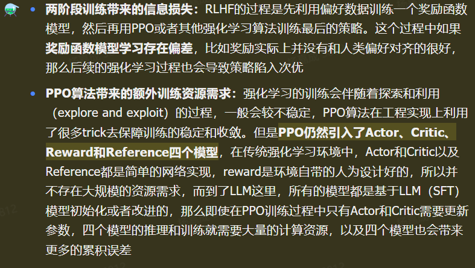

# 3.4.2 DPO公式推导

详见文档

DPO**基于 Bradley-Terry 偏好模型假设**，以及**强化学习的目标，推导得出 DPO 目标函数**，去掉了Reward和Critic两个模型，优化了对齐的流程，只需要端到端的一步就能从偏好数据到最终策略

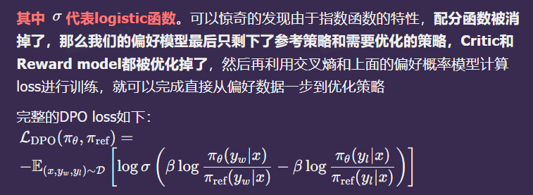

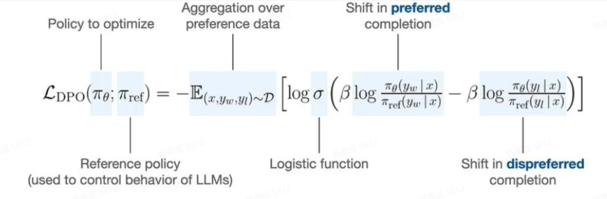

## 各部分对应解释

| 标注                                 | 含义                                                         |
| ------------------------------------ | ------------------------------------------------------------ |
| **Policy to optimize**               | 待优化的目标策略 πθ，即我们要训练的大模型                    |
| **Reference policy**                 | 参考策略 πref，通常是预训练模型或 SFT 后的模型，用来控制 LLM 行为，防止训练后偏离过远 |
| **Aggregation over preference data** | 对偏好数据集 D 求期望 E，数据集中每个样本是 (x,yw,yl)：输入 x，对应一个偏好输出 yw 和一个非偏好输出 yl |
| **Logistic function**                | Sigmoid 函数 σ(⋅)，用来把偏好得分映射到 [0,1] 区间，衡量模型对 yw 相对 yl 的偏好程度 |
| **Shift in preferred completion**    | 对应项 βlogπref(yw∣x)πθ(yw∣x)，衡量目标策略对偏好输出 yw 的相对优势 |
| **Shift in dispreferred completion** | 对应项 βlogπref(yl∣x)πθ(yl∣x)，衡量目标策略对非偏好输出 yl 的相对优势 |

## 一句话总结推导逻辑

1. 从**带 KL 约束的 RL**出发
2. 写出**最优策略与奖励的关系**
3. 代入**Bradley-Terry 偏好模型**
4. **直接消掉 reward 和 critic**
5. 得到**只用偏好数据的端到端损失**

这就是 DPO 为什么能**去掉 Reward、Critic，一步对齐**

# 3.4.3 DPO理解和代码

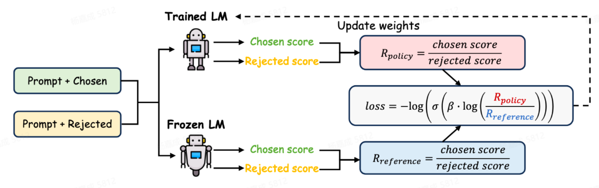

这张图展示了 **DPO（Direct Preference Optimization，直接偏好优化）** 的核心训练流程，是大模型对齐人类偏好的关键步骤。我帮你拆解一下：

------

1. 输入数据

- **Prompt + Chosen**：用户提示 + 人类偏好的回答（“好的” 回答）
- **Prompt + Rejected**：同一用户提示 + 人类不偏好的回答（“差的” 回答）

这两组数据构成了 DPO 的偏好数据集。

------

2. 两个关键模型

1. **Trained LM**：正在被优化的目标模型（我们要训练的大模型），它的权重会被更新。
2. **Frozen LM**：参考模型（Reference Model），通常是预训练或 SFT 后的模型，权重被冻结，用来提供稳定的参考基准。
3. 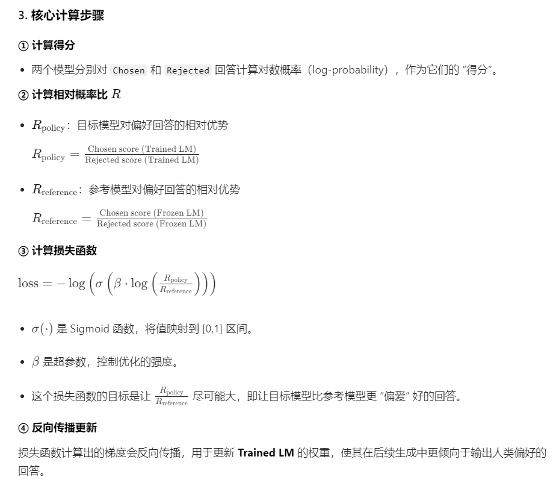

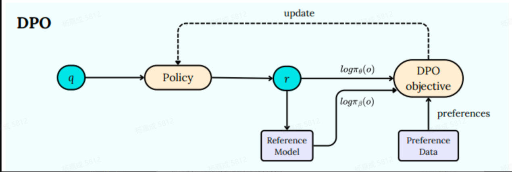

这张图是 **DPO（Direct Preference Optimization，直接偏好优化）** 的核心流程示意图，我帮你逐部分拆解：

------

1. 各符号与模块含义

- **q**：输入查询 / 提示（Prompt），比如用户的问题。
- **Policy**：待优化的目标策略模型（πθ），也就是我们要训练的大模型。
- **r**：输出结果（Response），即模型生成的回答。
- **Reference Model**：参考策略模型（πβ），通常是预训练或 SFT 后的模型，权重固定，作为优化的基准。
- **Preference Data**：偏好数据，包含 “偏好回答” 和 “非偏好回答” 的配对样本，是训练的监督信号。
- **DPO objective**：DPO 的目标函数（损失函数），用来衡量当前策略与偏好数据的匹配程度。

------

2. 流程拆解

1. **输入查询**：输入查询 `q` 到目标策略 `Policy`。
2. **生成输出**：目标策略 `Policy` 根据输入 `q` 生成输出 `r`。
3. 计算对数概率：
   - 目标策略 `Policy` 对输出 `r` 计算对数概率：logπθ(o)
   - 参考模型 `Reference Model` 对输出 `r` 计算对数概率：logπβ(o)
4. **计算目标函数**：将两个对数概率和偏好数据 `Preference Data` 输入 `DPO objective`，计算损失。
5. **更新策略**：根据损失函数的梯度，反向传播更新目标策略 `Policy` 的参数，使其更符合偏好数据。

## 如何理解DPO loss

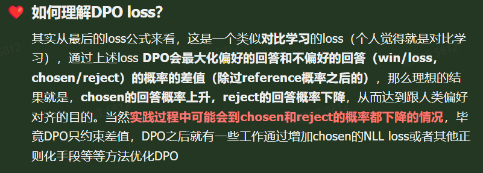

==**代码见文档**==

## ==PPO VS DPO==

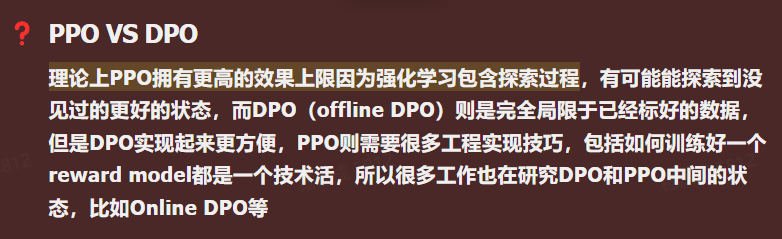

### PPO vs DPO 极简对比

1. **效果上限**
   - **PPO 更高**：它是**在线强化学习**，会**主动探索**新策略、新回答，能跳出已有数据，找到更优解。
   - **DPO（离线）更低**：只在**已有偏好数据**里学 “哪个更好”，**不探索、不创造**，上限被数据框死。
2. **训练难度 & 工程**
   - **PPO 复杂**：要训**奖励模型 RM**、要处理**策略 / 价值网络**、要调超参、要防崩溃，工程门槛高。
   - **DPO 简单**：**不需要奖励模型、不需要 RL 循环**，直接用偏好对做对比学习，像训普通 LM 一样好跑。
3. **现在的趋势**
   大家在做**中间路线**：
   - **Online DPO / IPO 等**
     想**保留 DPO 的简单稳定**，同时**加入一点点探索**，逼近 PPO 的上限，但更稳更好训。

------

**一句话收尾：**
**PPO 强在探索上限高，DPO 强在简单好落地，现在主流是往中间走：带一点探索的轻量对齐算法。**

## 3.4.4 人类偏好建模角度理解DPO

如果有人让你讲解DPO的推导过程，那么绕不开的一个地方便是**配分函数**，怎么就突然看出来一个这个玩意把他提取出来，然后后续的计算过程中就能给他约分掉呢？实在是难以让人理解，下面的内容带你从另一个视角来理解DPO算法

### 偏好模型核心定义

把人类对内容、方案、产品的**相对偏好**（A 比 B 好），建模为可预测的**评分 / 概率模型**，用于指导生成、推荐、决策系统更贴合人类喜好。

#### 核心流程（以大模型 RLHF 为例）

1. **数据收集**：人工标注 “成对比较”（如 A 回答 vs B 回答，选更优）。
2. **训练偏好模型（PM）**：学习为每个选项输出偏好分数，用 sigmoid 映射为 “偏好概率”。
3. **对齐优化**：用偏好模型的分数作为奖励，通过强化学习（如 PPO、DPO）优化生成模型。
4. **迭代闭环**：线上反馈→更新偏好模型→再优化，持续对齐。

#### 典型模型与方法

- **Bradley-Terry 模型**：经典成对偏好建模，为每个选项赋分，用分数差算偏好概率。
- **奖励模型（RM）**：大模型对齐主流，输出连续偏好分。
- **DPO/GRPO**：直接偏好优化，无需显式奖励模型，更高效。

#### 整段内容的核心一句话总结

传统 DPO 推导从**奖励 + 单步 MDP + 配分函数**出发，数学好看但直觉别扭；
**从人类偏好建模重新看 DPO：**

1. 奖励不适合衡量偏好，**优势函数才适合**
2. 优势函数在约束 RL 里**直接正比于 log π / π_ref**
3. 把偏好建模直接写成**策略之比**
4. 单步下自然退化成**标准 DPO**

### ==5 条核心考点（直接背诵版）==

1. **DPO 传统推导的局限**：仅成立于「单步 MDP」（如大模型 s→y 一步输出），多步 MDP（多轨迹、状态转移）下推导失效；配分函数是数学技巧，直觉上需从偏好建模本质理解。
2. **传统 RLHF 偏好建模的缺陷**：用「奖励函数 R」衡量偏好，仅看轨迹总奖励，无法区分 “方向正确性”（如寻路中 “靠近目标” 与 “远离目标” 的轨迹，总奖励相同但人类偏好不同）。
3. **关键替换：优势函数 A 替代奖励 R**：优势函数 A (s,a) 衡量 “当前动作比平均动作好多少”，天然捕捉 “方向价值”，是更贴合人类偏好的度量（累积优势值可区分轨迹优劣）。
4. **核心等式：优势函数 ↔ 策略**：带行为约束的 RL 中，最优优势函数与最优策略直接相关：$\(A^*(s,a) \propto \log \frac{\pi^*(a|s)}{\pi_{\text{ref}}(a|s)}\)$，无需先学奖励 / 优势函数，可直接建模策略。
5. **DPO 的本质（从偏好建模视角）**：将人类偏好概率（Bradley-Terry 模型）直接用「策略之比」表示，单步 MDP 下简化为标准 DPO 损失，多步 MDP 下也可扩展适用。

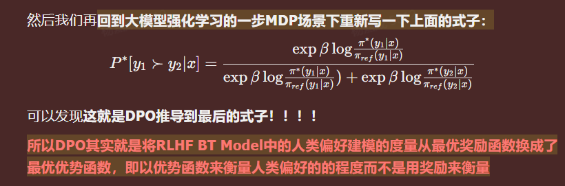

推导过程见文档

**==所以DPO其实就是将RLHF BT Model中的人类偏好建模的度量从最优奖励函数换成了最优优势函数，即以优势函数来衡量人类偏好的的程度而不是用奖励来衡量==**

## 3.4.5 对比学习角度理解DPO

#### 从对比学习理解 DPO（极简版）

1. **对比学习（一般形式）**

   - 给一个**锚点样本**
   - 有**1 个正样本**、N 个负样本
   - 目标：
     - 让**锚点 ↔ 正样本** 距离更近（相似度更高）
     - 让**锚点 ↔ 所有负样本** 距离更远
   - 用相似度（比如点积）做损失，拉正推负。

2. **DPO 本质**

   - 每一步只有：

     - **1 个策略模型 = 锚点**
     - **1 个正样本（人类偏好的回答）**
     - **1 个负样本（人类不偏好的回答）**

   - 所以 DPO 就是：

     > **正负样本数量都 = 1 的特殊对比学习**

3. **DPO 在做什么**

   - 用对数概率差当作**相似度 / 距离**
   - 让策略模型**靠近正样本**
   - 让策略模型**远离负样本**
   - 全程**不用显式训练奖励模型、不用 RL 优化**，直接用偏好对做对比。

------

一句话总结：
**DPO = 一对一的对比学习，用偏好对直接把模型拉向好回答、推开差回答。**

# 3.4.6 DPOP算法        

🕢  **解决痛点**：好答案 & 坏答案被采样的概率同时在变低，只不过坏答案降低的比好答案更多    

**做法**：    

为此，DPOP在 DPO loss 的基础上加入了一个正则项：    

•  若当前 chosen 答案在 SFT 模型中采样概率 > 当前 Policy 模型的采样概率，则减去一个正则化系数（当前的 chosen 答案 policy 还没有拟好，别再更新那么猛了）；    

•  若当前 chosen 答案在 Policy 模型中采样概率更高，证明 Policy 已经对这个 chosen 答案拟合的比较充分了，此时着重降低一下坏答案的采样概率。      

# 3.4.7 TDPO算法

### 核心概念解析

#### 1. 先搞懂：KL 散度（KL Divergence）

KL 散度是衡量**两个概率分布之间差异**的指标，核心特点是**非对称**—— 计算 "A 相对于 B 的 KL 散度" 和 "B 相对于 A 的 KL 散度" 结果完全不同，这也是 forward/backward KL 的本质。

- **SFT 模型**：可以理解为 "基准模型"（reference model），是训练的起点；
- **Policy Model**：是我们正在优化的模型（待训练模型）。

#### 2. Forward KL vs Backward KL（核心区别）

| 类型                  | 计算方式（对应代码）                                         | 核心目标                                                     | 模型输出特性                 |
| --------------------- | ------------------------------------------------------------ | ------------------------------------------------------------ | ---------------------------- |
| Backward KL（PPO 用） | `vocab_logps - reference_vocab_logps`（代码注释 5）          | 让 Policy 模型的分布 "贴合"SFT 模型的分布（重点拟合 SFT 的高概率区域） | 输出集中、风格单一、多样性差 |
| Forward KL（TDPO 用） | `reference_vocab_ps * (reference_vocab_logps - vocab_logps).sum(-1)`（代码 6） | 让 Policy 模型的分布 "覆盖"SFT 模型的分布（不局限于高概率区域） | ==输出更自由、多样性更高==   |

### 总结

1. **核心差异**：TDPO 和 PPO 的关键区别是 KL 约束的计算方向 ——TDPO 用 Forward KL（KL (SFT||Policy)），PPO 用 Backward KL（KL (Policy||SFT)）；
2. **计算逻辑**：**Forward KL 以 SFT 模型的概率为权重**，Backward KL 以 Policy 模型的概率为权重；
3. **效果差异**：Forward KL 让模型输出更自由、多样性更高，Backward KL 让模型输出更集中、风格更统一。

# 3.4.8 Self-Reward

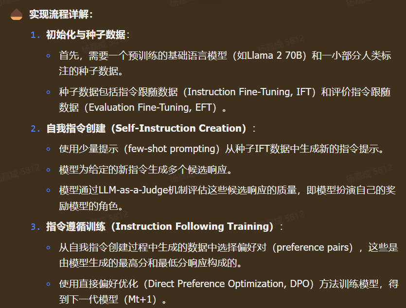

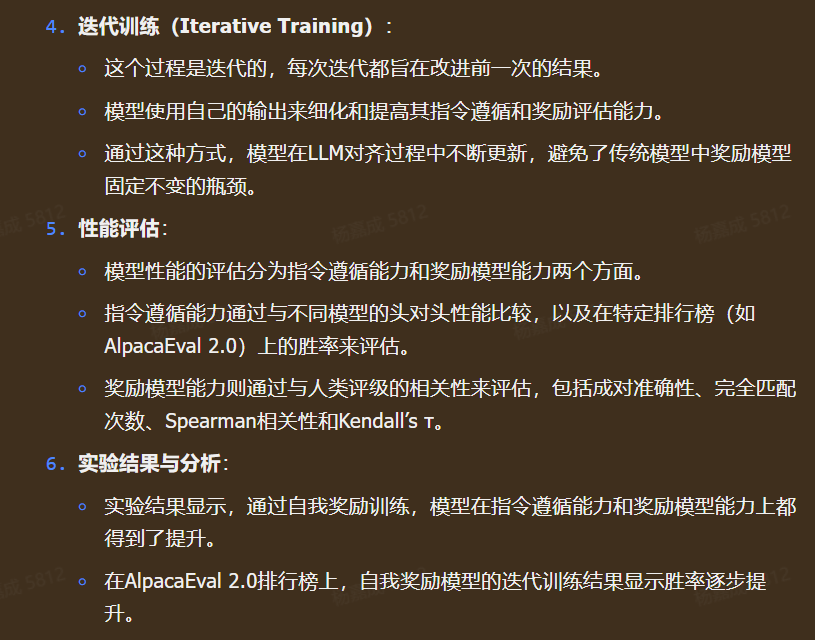

### Self-Reward（自奖励）核心解析

**Self-Reward** 是一种**无需人工标注**的大语言模型（LLM）对齐训练范式，其核心突破在于打破了传统 RLHF（基于人类反馈的强化学习）中 “奖励模型固定” 的瓶颈，让模型**自己充当 “出题人”、“考生” 和 “阅卷人”**，通过迭代实现自我进化。

结合你提供的流程与实验，其核心逻辑可归纳为以下三点：

#### 1. 核心闭环：自我生成 → 自我评判 → 自我优化

整个流程是一个 ** 自举（Bootstrapping）** 的循环，每一轮迭代（t）都会生成更强的下一代模型（Mt+1）：

1. **自我指令创建**：模型自己生成多样化的用户指令（Prompts），解决了人工指令数量有限的问题。
2. **自我作答与评分**：模型对自己生成的指令给出多个响应，并用预设的评分标准（如你提供的 5 分制 Prompt）对这些响应进行**自我打分**。
3. **偏好优化（DPO）**：筛选出打分最高（最优）和最低（最差）的响应对，作为 DPO 算法的训练数据，直接微调模型，使其学会 “说高分话”。

#### 2. 关键技术点：用 DPO 替代传统 RLHF

传统的 RLHF 需要先训练一个独立的奖励模型（RM），再用强化学习（PPO）微调大模型，过程复杂且奖励模型容易过时。
**Self-Reward** 则直接将**模型的自我评分**作为偏好信号，通过**DPO（直接偏好优化）** 一步到位完成对齐。这种方式更高效，且因为每一轮都用新模型重新评分，奖励标准会随着模型能力的提升而动态进化。

#### 3. 实验结论的核心启示

你列出的实验结果揭示了该方法的两个重要特性：

- **能力无损**：引入自奖励训练（EFT）不会损害模型原本的指令跟随能力（胜率 30.5% vs 30.9%），消除了 “偏科” 的顾虑。
- **持续进化**：对比仅使用 IFT（指令微调）的基线模型，**随着迭代轮数增加，Self-Reward 模型的性能（如 AlpacaEval 胜率）持续单调提升**。这证明了自我反馈的有效性 —— 模型确实能通过 “自我批改” 变得越来越强。

### 总结

Self-Reward 的本质是**用模型的自我认知代替人类的先验标注**。它通过一套标准化的评分 Prompt（如 5 分制标准）建立了客观的自我评判体系，再利用 DPO 将评判结果转化为模型的行为准则，最终实现了**低成本、高迭代**的全自动对齐。

## 3.4.9 KTO

Kahneman-Tversky Optimization     链接：https://arxiv.org/pdf/2402.01306

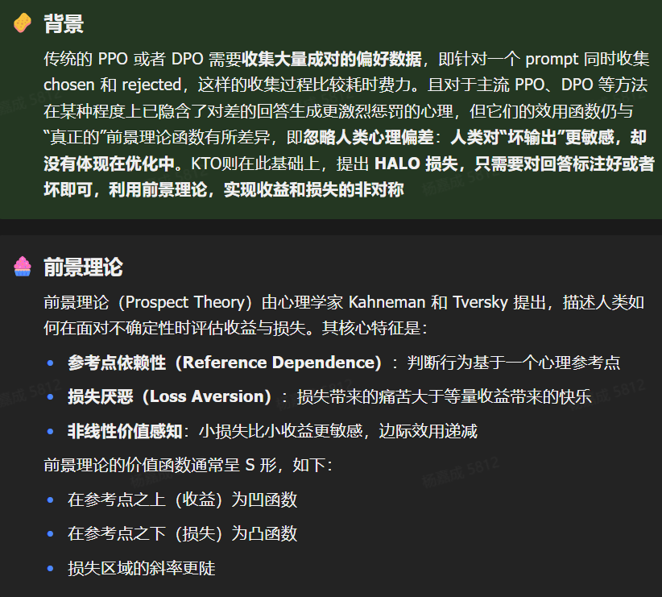

KTO 是基于**前景理论**设计的大模型对齐方法，归属于**HALOs（Human-Aware Loss）** 损失家族，解决了传统 DPO/PPO 依赖成对偏好数据、未贴合人类心理偏差的问题，仅需**二元反馈（好 / 坏）** 即可实现更优的模型对齐，核心是让模型的优化目标贴合人类对收益 / 损失的非对称感知。

<u>HALOs:这个目标函数用来刻画人类对“好”与“坏”生成的感知差异，使模型以更拟人化的方式学习偏好</u>

#### 1. 核心解决的痛点

- 传统 DPO/PPO 需要**成对偏好数据**（一个 prompt 的优质回答 + 劣质回答），收集成本高、耗时；
- 主流对齐方法虽隐含对劣质输出的惩罚，但效用函数未贴合**人类真实心理偏差**（损失厌恶、参考点依赖等），优化效率和效果受限。

####  

#### KTO 的核心优势

1. **数据成本低**：仅需二元反馈，无需成对偏好，可高效规模化收集；
2. **贴合人类心理**：显式融入损失厌恶、参考点依赖等人类决策偏差，对齐效果更符合人类预期；
3. **性能更优**：在 1B~30B 模型尺度上**匹配 / 超越 DPO**，尤其在数学推理、人类主观评价上提升显著；
4. **鲁棒性强**：可处理 90% 比例的优质样本缺失，且无需 SFT 预训练即可直接训练（大模型尺度下）；
5. **抗噪声 / 矛盾数据**：面对偏好数据中的矛盾标注（如部分人认为 A 好，部分认为 B 好），KTO 会倾向于多数偏好，而 DPO 可能偏向少数，最坏情况表现更优。

#### 6. 与 DPO 的核心区别

| 维度         | KTO                          | DPO                         |
| ------------ | ---------------------------- | --------------------------- |
| 数据要求     | 二元标签（好 / 坏）          | 成对偏好（chosen/rejected） |
| 核心优化目标 | 最大化人类效用（前景理论）   | 最大化偏好的对数似然        |
| 参考点       | 批次内不匹配样本估计，动态化 | 以劣质样本为固定参考点      |
| 损失厌恶     | 显式通过$λ_D/λ_U$控制        | 隐式体现，无专门超参数      |
| 数据不平衡   | 天然支持，超参数可平衡       | 依赖成对数据，难以处理      |

### 一句话总结

KTO 是**前景理论在大模型对齐的落地产物**，通过 HALOs 损失框架将人类的损失厌恶、参考点依赖等心理偏差显式融入模型优化，仅用二元反馈就实现了比 DPO 更高效、更鲁棒的对齐，大幅降低了对齐的数据成本，同时提升了模型输出的人类适配性。

# 3.4.10 DPO优化

### 一、DPO 为何退居非主流

DPO（Direct Preference Optimization）是 2023 年的偏好优化范式，**直接用成对偏好数据优化策略、无需奖励模型与价值网络**，曾因简单高效流行。但 2024 年暴露致命短板：

- **依赖高质量成对数据**：需明确 “优胜 / 劣汰” 样本，复杂推理（数学、代码）难标注，数据成本高、噪声大。
- **不适应稀疏 / 可验证奖励**：仅支持偏好反馈，无法利用 “答案对错、代码运行” 等可验证规则奖励，长推理任务表现差。
- **组内对比缺失**：单样本优化，无法利用同输入多输出的相对信息，收敛慢、易过拟合。
- **工程扩展性弱**：大模型 + 长文本下，成对数据处理与梯度计算效率低，难以支撑千亿参数训练。

### 二、RLVR+GRPO 为何成主流

==RLVR（Reinforcement Learning with Verifiable Rewards）==是**基于可验证奖励的强化学习**，核心是用**规则化、可自动计算的奖励**（如答案正确、代码通过）替代人工偏好，GRPO 是其最成功实现。

#### GRPO 核心创新（DeepSeek 2024）

- **无 Critic、组内相对优势**：去掉价值网络，同输入生成多组输出，用组内平均奖励做基线，计算相对优势，显存降约 50%、训练更稳。
- **适配稀疏 / 可验证奖励**：直接用 “对错 / 通过率” 等规则奖励，无需标注，数学、代码等推理任务效果爆发（如 DeepSeekMath、R1）。
- **算力友好、易扩展**：组内并行采样，减少中间变量，超参数少，适配大模型与长文本训练。
- **训练更稳、收敛更快**：组内归一化抑制噪声，避免 DPO 的成对数据偏差，复杂任务收敛效率显著更高。

### 三、核心差异对比（一句话总结）

- **DPO**：偏好驱动、成对数据、单样本优化→**简单但难适配复杂推理、数据成本高**。
- **GRPO（RLVR）**：可验证奖励驱动、组内对比、无 Critic→**算力省、推理强、易扩展、2024 工业界首选**。
- 

一句话结论：**2024 年大模型对齐从 “偏好优化（DPO）” 转向 “可验证奖励强化学习（RLVR）”，GRPO 因效率与效果双优成为绝对主流**。

面给你整理成**一页极简对比表**，方便直接记、直接用。

# ==大模型对齐方法对比：PPO / DPO / GRPO（RLVR）==

| 维度                    | PPO                 | DPO                 | GRPO（RLVR 主流）                    |
| ----------------------- | ------------------- | ------------------- | ------------------------------------ |
| 核心思想                | 带价值网络的在线 RL | 直接偏好优化，无 RL | 可验证奖励 + 组内相对优势，无 Critic |
| 是否需要奖励模型 RM     | 需要                | 不需要              | 不需要（可用规则奖励）               |
| 是否需要价值网络 Critic | 需要                | 不需要              | 不需要                               |
| 数据形式                | 任意奖励            | 成对偏好数据        | 同输入多输出（组内对比）             |
| 训练稳定性              | 差，超参难调        | 较好                | 很稳                                 |
| 显存占用                | 高                  | 中                  | 低（省约 50%）                       |
| 适合任务                | 通用对话            | 简单偏好对齐        | 数学、代码、推理、长文本             |
| 2024 地位               | 传统主流            | 非主流              | 工业界主流                           |
| 核心优势                | 经典、成熟          | 简单、好复现        | 效率高、推理强、可自动奖励           |

------

# 一句话进化路线

PPO（复杂难训）
→ DPO（简单但只能偏好）
→ **GRPO / RLVR（可验证奖励 + 组内对比，2024 真正主流）**

#### 1. 绝对核心：GRPO + RLVR（2025–2026 工业界首选）

- **定位**：可验证奖励 + 组内相对优化，**无 Critic、省显存、稳训练、强推理**。
- 2025 进化：
  - 从数学 / 代码扩展到**通用对话、长文本、工具调用、多模态**。
  - 加入**过程奖励（PRM）+ Token 级细粒度奖励**，解决稀疏奖励信用分配。
  - 支持**自我奖励循环**（模型自评 + 自训），大幅降低标注成本。
- 2026 升级：
  - **GRPO 2.0/URPO**：统一奖励 + 策略优化，生成与评判协同进化。
  - 融合**多智能体自对弈（SPPO）**，处理非传递性偏好，逼近纳什均衡。
  - 算法 - 系统协同（异步 RL、量化 Rollout），适配 7B + 千亿模型。

==2025–2026 年，**GRPO/RLVR 是绝对主流**，DPO 退为轻量基线，推理时增强、统一框架、安全对齐是三大升级方向；工业界将全面采用 “**GRPO 底座 + 场景增强**” 的组合方案。==

####  非主流 / 淘汰（2025 后基本不用）

- **PPO**：复杂、显存高、难调，仅在极个别传统 RL 场景保留。
- 纯离线偏好（无 GRPO 增强）：仅用于快速原型，不做 SOTA。