# RLHF笔记

3.3 RLHF 基于人类反馈的强化学习

**Reinforcement Learning from Human Feedback** / Preference-based Reinforcement Learning 基于人类反馈的强化学习 / 基于偏好的强化学习    

本章主要包含==RLHF-PPO==的讲解及其改进算法==GRPO==等以及==GRPO的改进算法==的详解

# 3.3.1 RL在NLP场景下的拓展

## NLP MDP建模

强化学习要应用到NLP任务中，需要进行马尔可夫决策过程MDP建模，**对应的agent、环境、状态和动作都需要明确的定义**，MDP详见3.2.2章节

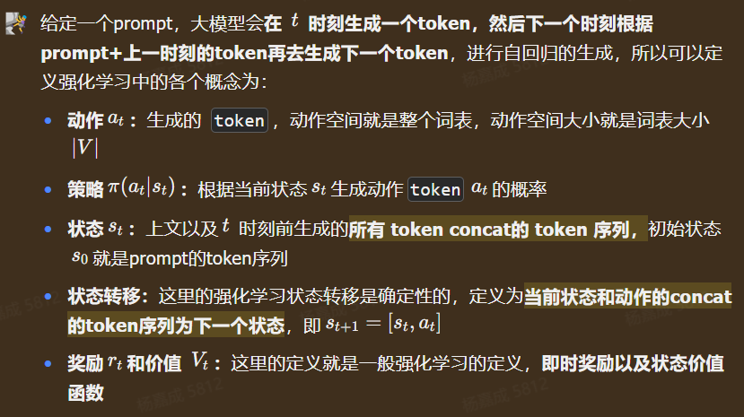

## NLP RL 优化目标

==**强化学习的优化目标是最大化累积奖励的期望值**==

**带行为约束（behavior-regularized）的强化学习优化目标等同于对奖励值做出了修改**

目的是==约束强化学习策略在一个距离行为/参考策略不太远的范围内进行更新，防止策略跑偏==，这个行为策略通常是offline数据集的行为克隆策略，或者是大模型中的SFT初始化策略（reference 策略）

# 3.3.2 RLHF流程

深度学习RLHF首次在2017年的论文 **Deep Reinforcement Learning from Human Preferences** 中被提出，**一开始是用于解决复杂强化学习任务中环境奖励函数设计问题的**

论文链接：https://arxiv.org/pdf/1706.03741

- 强化学习在许多任务中面临**目标复杂、难以定义奖励函数**的问题，导致难以将人类实际目标传达给智能体  
- 不正确的、有偏的奖励函数会导致智能体过分利用(exploit)奖励函数，产生**reward hacking**问题，即**实际学到的行为与人类期望不符合，甚至有害**  
- 奖励函数的设计工程需要大量的专业人士的精力 
- 现有方法如逆强化学习和模仿学习在**处理复杂行为时存在局限性**，**直接使用人类反馈作为奖励函数成本过高**

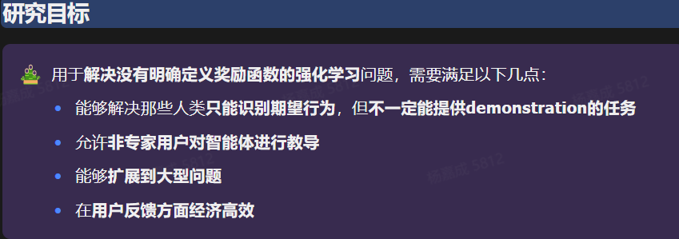

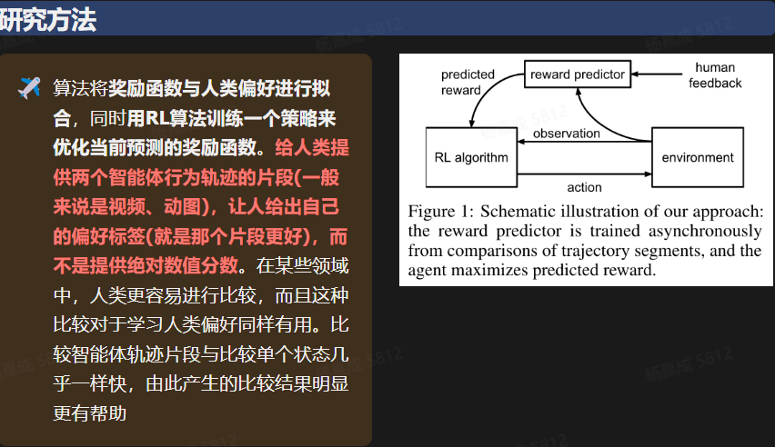

#### 一、整体思路

不用人打分，只让人**比好坏**：
给人看两段智能体的行为视频 / 轨迹，人只选「哪个更好」，模型用这些**对比偏好**去学奖励函数，再用强化学习练策略。

------

#### 二、关键步骤极简版

1. **收集偏好**
   给人看两段智能体轨迹，人只打标签：A 比 B 好 / B 比 A 好 / 差不多。
   不用给具体分数，人更轻松、结果更有用。

2. **偏好建模（Bradley-Terry）**
   假设：人更喜欢某段轨迹的概率，和这段轨迹的**总奖励指数相关**。
   用这个模型把「人类偏好」和「奖励」绑在一起。

   （偏好建模：由于RLHF的一个目标是将奖励函数与人类偏好进行拟合，就是**利用人类的比较偏好标签来学出一个reward model**，那就涉及到了奖励函数和偏好之间的关联问题，这里给出的方法是，将奖励函数视为解释人类判断的潜在因素，并**假设人类偏好一个片段的概率与潜在奖励在该片段长度上的总和呈指数相关**）

3. **学奖励模型**
   把偏好学习当成**二分类任务**：
   输入两段轨迹，输出「哪段更可能被偏好」。
   用**交叉熵损失**训练，学到一个能拟合人类偏好的奖励函数。

4. **学策略**
   用学到的奖励函数，做普通强化学习，让智能体**最大化奖励**。

5. **在线 RLHF（这篇的亮点）**
   奖励模型和策略**交替、同时训练**：
   智能体不断和环境交互→产生新轨迹→让人打标签→更新奖励→更新策略→循环。

------

#### ==一句话总结==

这是一套**在线式 RLHF**：
==用人类**轨迹对比偏好**，通过 Bradley-Terry 模型 + 交叉熵学奖励，再用 RL 学策略，且奖励和策略全程交替迭代、边交互边更新。==

### 研究总结

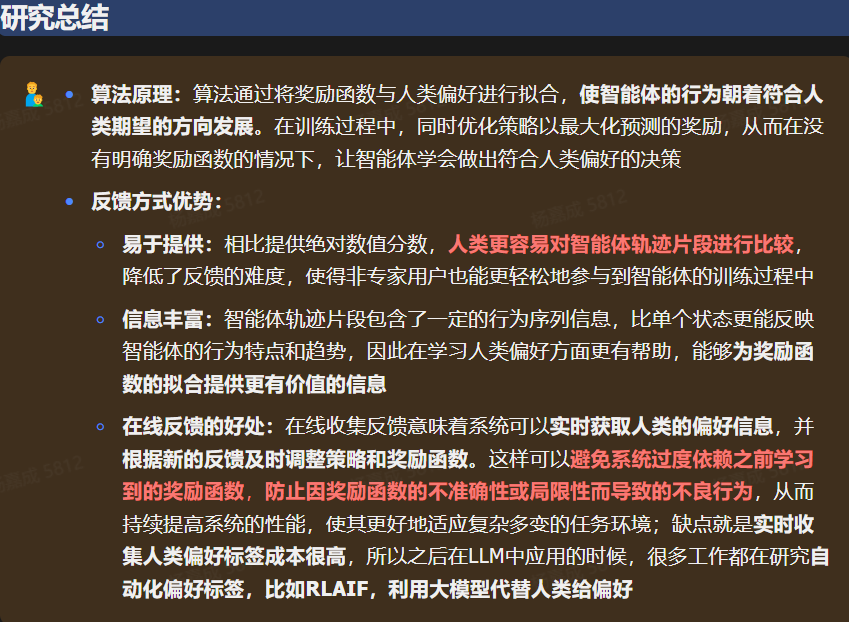

# 3.3.3 LLM对齐中的RLHF+PPO

训练框架仍然选用`OpenRLHF`比较方便好用

## InstructGPT

现在又看回来具体在LLM的对齐中是怎么应用上面那一套RLHF的流程和PPO算法的，**OpenAI最早在InstructGPT中将RLHF技术应用在LLM post-training中，使模型真正与人类意图对齐**    

论文：Training language models to follow instructions with human feedback    链接：https://arxiv.org/pdf/2203.02155

## 这里文档的总结更精炼，下面有废话

#### 一、一句话核心

OpenAI 在 InstructGPT 中首次将**RLHF（人类反馈强化学习）** 系统性用于 LLM 后训练（post-training），把 “人类偏好” 转化为可训练信号，让模型从 “预测下一个词” 转向**真正对齐人类意图**（有用、诚实、无害）。

#### 二、背景：为什么需要 RLHF

- 预训练 LLM（如 GPT-3）目标是**拟合互联网文本分布**，而非遵循人类指令；常出现**偏离指令、编造事实、生成有害内容**等问题。
- 单纯扩大模型规模无法解决 “对齐” 问题，必须引入**人类反馈**修正模型行为。

#### ==三、InstructGPT 的 RLHF 三阶段（后训练核心）==

1. 监督微调（SFT）
   - 用人工标注的高质量指令 - 回答数据，对 GPT-3 做初步微调，让模型先学会**基本指令跟随**。
2. 奖励模型（RM）训练
   - 让 SFT 模型对同一提示生成多个候选；人类标注员按 “偏好度” 排序；用排序数据训练**奖励模型**—— 学会给任意回答打 “人类偏好分”。
3. 强化学习优化（PPO）
   - 以 SFT 模型为初始策略，用**PPO 算法**让模型生成回答；奖励模型打分作为 “奖励信号”，引导模型**持续向人类偏好方向优化**；同时加入预训练数据梯度，避免能力退化。

#### 四、关键意义

- 首次建立**可复现的 LLM 对齐框架**，让模型从 “能生成文本” 升级为 “**听懂人话、按人类意图输出**”。
- 小参数量 InstructGPT（1.3B）效果超越 175B 原始 GPT-3，证明**对齐比单纯扩参更关键**。
- 为 ChatGPT、GPT-4 等后续模型奠定**对齐技术基础**。

### InstructGPT 极简流程解析

1. **第一步：SFT 监督微调**
   用 GPT-3 做有监督指令微调，让模型先学会 “听懂并跟着指令输出”。
2. **第二步：训练 Reward Model（奖励模型）**
   - 人工对**同一个 prompt 的多个回答做排序**。
   - 把排序转成**两两对比的偏好标签**。
   - 在 SFT 模型基础上，**去掉最后的输出层，加一个线性层映射成单个奖励分数**，训练 RM 给回答打分。
3. **第三步：PPO 强化学习**
   - 以 SFT 模型为起点，用 PPO 最大化 RM 给出的奖励。
   - 加 **token 级 KL 散度约束**，防止新模型和 SFT 差太远、乱生成。
   - 再加 **预训练数据梯度（PPO-ptx）**，避免在通用 NLP 任务上掉点。
4. **整体四件套模型**
   Actor（生成回答）、Critic（评估价值）、Reward（打分）、Reference（SFT 基准）。

------

一句话浓缩：
**先指令微调学会听话 → 人工排序训打分模型 → 带约束的强化学习优化对齐 → 最终得到 InstructGPT。**

### ==InstructGPT 核心流程（面试版）==

#### 一、整体目标

基于 GPT-3 迭代优化，让模型具备更强的**指令遵循能力**，同时避免性能回归，最终实现 “听懂人类指令、输出符合预期回答” 的对齐目标。

#### 二、三大核心步骤（递进式训练）

##### 1. 第一步：SFT（监督微调）—— 基础能力搭建

- 核心动作：用 “指令 - 正确回答” 的标注数据，对 GPT-3 进行有监督微调。
- 核心目标：让模型先学会 “理解指令、按指令生成内容”，打下指令遵循的基础，得到 SFT 模型（后续作为关键基准）。

##### 2. 第二步：RM（奖励模型）训练 —— 建立 “好坏” 评判标准

- 数据准备：人工对 “同一个 prompt 的多个模型回答” 做**排序标注**，再将排序转换为 “两两对比的偏好标签”（比如 A 回答比 B 好、B 比 C 好）。
- 模型构建：基于 “移除最后输出层（unembedding）的 SFT 模型”，新增一个 [hidden_size, 1] 的线性层，训练后可接收 “prompt+response”，输出单个标量奖励值（分数越高，回答越符合人类偏好）。
- 核心目标：训练一个能精准评判回答质量的 “打分模型”。

##### 3. 第三步：PPO 强化学习 —— 优化对齐 + 约束风险

- 优化目标：以 SFT 模型为起点，用 PPO 算法最大化 RM 给出的奖励值，让模型输出更符合人类偏好的内容。
- 两大关键约束（避免问题）：
  1. Token 级 KL 散度约束：限制 RL 模型与 SFT 模型的输出差异，防止 “过优化” 导致偏离指令逻辑、乱生成。
  2. PPO-ptx（预训练数据梯度）：加入通用预训练数据的梯度，修复在公开 NLP 任务上的性能回归。
- 核心目标：在 “对齐人类偏好” 和 “保持基础性能” 之间找平衡。

#### ==三、核心模型组件（四件套）==

Actor（生成回答的 RL 模型）、Critic（评估价值）、Reward Model（打分）、Reference（SFT 模型，作为行为基准）。

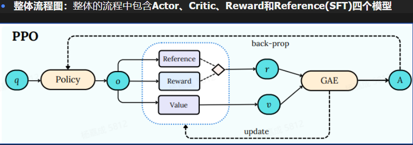

## Actor Model

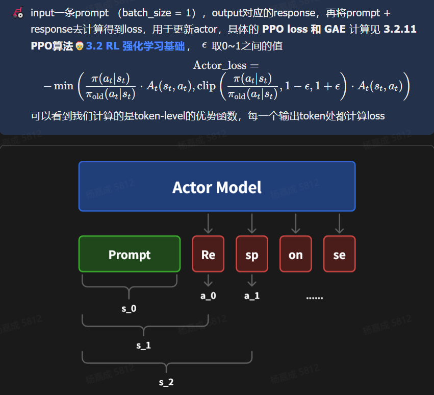

## Critic Model

### 核心功能

Critic Model 的核心目标是**精准预测某个状态（比如用户的 prompt，记为 S0）对应的 “期望总收益”（V 值）**，这个 V 值就是对 “当前状态下后续能获得的总奖励” 的预估。

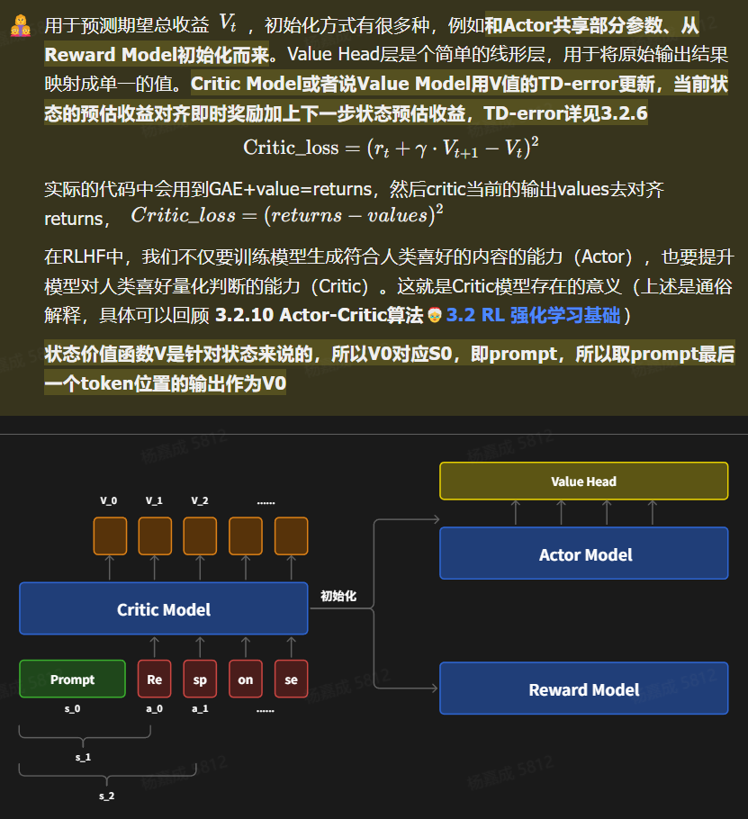

### 总结

1. Critic Model 的核心是**预估状态的期望总收益（V 值）**，为 Actor 提供 “好坏判断” 的量化依据；
2. 它通过 Value Head 输出单一 V 值，用 TD-error/GAE 让预估 V 值对齐真实收益（即时奖励 + 下一步预估收益）来更新；
3. 在 RLHF 中，Critic 负责 “量化人类喜好”，是 Actor 优化生成策略的关键支撑。

## Reward Model

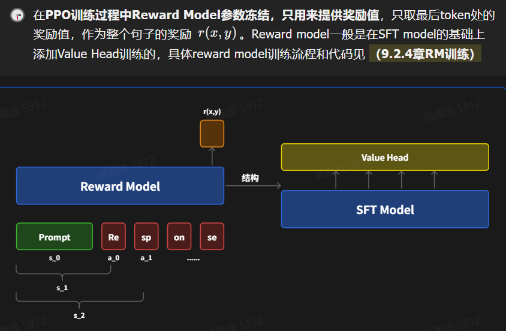

### 总结

1. PPO 阶段的 RM 是 “固定裁判”：参数不更新，仅通过最后 token 的输出为整句提供奖励值，指导策略模型优化。
2. RM 的基础是 SFT 模型 + Value Head：复用 SFT 的语义理解能力，通过新增的价值头实现 “句子好坏打分” 的核心功能。
3. RM 的训练核心是学习人类偏好：通过对比标注数据，让模型学会对更符合人类期望的句子给出更高奖励。

## ==传统 RL 里的 RLHF vs 大模型里的 RLHF（核心两点区别）==

1. **奖励来源不一样**
   - 传统强化学习 RLHF：对**一整条轨迹**里**每一步（状态 - 动作对）\**都给奖励，最后\**求和**。
   - 大模型 Reward Model：**只给整个回复一个总奖励**，没有逐步奖励。
2. **对比的前提不一样**
   - 传统 RL：用来对比的两条轨迹，**起点（初始状态）可以不一样**。
   - 大模型偏好数据：用来对比的两条回复，**起点（prompt）必须完全相同**。

### 大模型 Reward Model 的 loss 两种理解

这段里重点讲的是**第一种理解**：

- Reward Model 训练时，**只取整个回复最后一个 token 对应的 value**，当作**整个回复的唯一 reward**。
- 也就是：**整段 response → 一个 scalar reward**。

这就是和传统 RL 最本质的差别：
传统是**逐步奖励 + 轨迹求和**
大模型是**单句总奖励 + 同 prompt 对比**

## Reference Model

一般也**用SFT阶段得到的SFT模型做初始化**，在PPO训练过程中，它的参数是冻结的，用来产生per-token 的KL约束项，防止策略导致偏离SFT模型太远，也就是训偏了

在 **PPO 强化学习**训练策略模型（Policy）时：

- 它的**参数全程冻结，不更新**
- 实时计算当前策略模型和它之间的 **per-token KL 散度**
- 把 KL 散度当成**惩罚项**放进 PPO 损失里

## Online & Offline RLHF

参考链接：https://www.zhihu.com/question/651021172/answer/3513159005    

Online和 Offline也可以回顾3.2.7章 🤶 3.2 RL 强化学习基础    

•  **Online 的核心思路就是**：**<u>让</u>**<u>**模型自己做生成，我们根据模型生成结果的好坏来打分，用于指导模型进行更新**</u>。Online 需要模型亲自输出答案，然后根据反馈学习；    

•  **Offline 的方法**：模型不需要亲自输出答案，根据提前收集好的Offline数据集中的给定的「好坏样本」来进行模拟学习。**Off Policy 的训练速度能够更快**（只用forward看大量的样本来学习，不用generate），**但非常依赖给定的数据是否和「模型自身能力」足够相近**。最理想的效果就是，找到大量和你自身水平差不多的玩家的对局资料给你学习，这些训练样本的利用率才是最高的。反之，对于 Online 所有的训练样本都是模型自己生成的

# ==3.3.4 PPO训练的Trick和问题==

### 模型层面

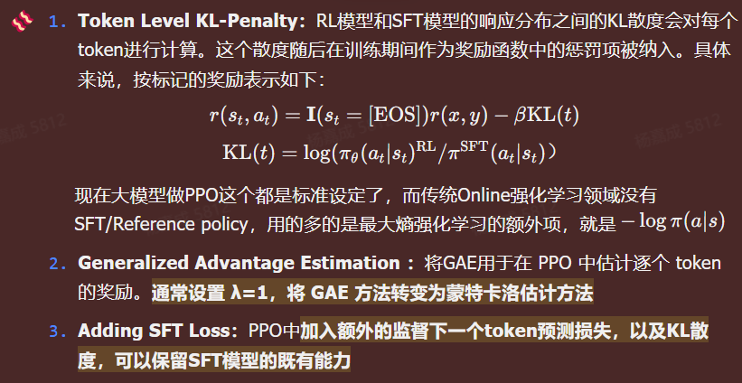

### PPO层面

#### 4. PPO-ptx

- 原本 PPO：最大化奖励 + KL 约束，防止跑偏。
- PPO-ptx = **PPO + 预训练数据集上的 loss（ptx loss）**。
- 目的：**防止模型忘掉预训练学到的语言能力**，减轻**对齐税**（RLHF 对齐人类偏好，但通用 NLP 能力下降）。
- Anthropic 结论：小模型对齐税明显；**大模型（13B–52B）几乎无对齐税，反而更强**。

#### 5. KL Reward（β 系数）

- PPO 里的 KL 散度前面有系数 β。
- 作用：**控制策略不要偏离 SFT 模型太远**，防止崩、塌、过拟合。
- 一般配合 **target KL** 调 β，靠实验。

#### 6. PTX Loss（γ 系数）

- 预训练 loss 也有系数 γ。
- InstructGPT 用 γ=27.8；
- 实践里：**γ 通常 < 1 才好收敛**，要和 policy loss、pretrain loss 量级匹配。

#### 7. Reward Normalization

- 奖励是奖励模型输出，**值域不稳定**。
- 归一化 → **PPO 训练更稳**。

#### 8. Distributed Advantage Normalization

- 优势函数（Advantage）要做**全局归一化**（所有卡 / 所有进程）。
- 很多开源 RLHF 框架只做单卡归一化，效果差。

同样 ==Advantage Normalization 也是PPO训练中常用的稳定训练的技术==，我们在使用 DeepSpeed 等类似 DDP 的训练手段时应注意做全局样本的 Advantage Normalization，而不是某个DDP进程只针对自己的样本做归一化。这一点目前的 RLHF 开源框架都没有充分考虑进来

### 9. Model Initialization

- Actor 用 **SFT 模型初始化**。
- Critic 用 **奖励模型初始化**。
- 这是标准、最快收敛的做法。

### 10. Adam LR

- Actor LR：**SFT 的 1/10**（更慢更稳）。
- Critic LR：**SFT 的～2 倍**。
- 例子：SFT=5e-6 → Actor=5e-7，Critic≈9e-6。

Actor model的Adam学习率大约是SFT模型学习率的十分之一。

**例如，在OpenRLHF中，SFT model的Adam学习率为5e−6，而actor model的学习率为5e−7。此外，评论者模型的Adam学习率大约是SFT model的两倍，一般设置学习率为9e−6**

### 11. Value Function Loss Clipping

- 价值网络 loss 做裁剪，**防止更新过猛、训练炸掉**，PPO 标配。

### 12. Advantage Normalization

- 优势函数用 Z-score 归一化：减均值、除标准差。(Z-score 归一化就是**把数据变成均值为 0、标准差为 1 的标准分布**，方便不同量纲的数据一起比较)
- 让训练对**极端奖励 / 大梯度不敏感**，更稳定。

------

### 奖励利用和泛化问题

- RLHF 里的核心痛点：
  1. **奖励利用**：模型只会钻奖励模型的空子，而不是真学会任务。
  2. **泛化**：对齐后，在没见过的场景 / 任务上能力掉点。
- PPO-ptx、KL 约束、归一化、小学习率…… 全都是在**缓解这两个问题**。

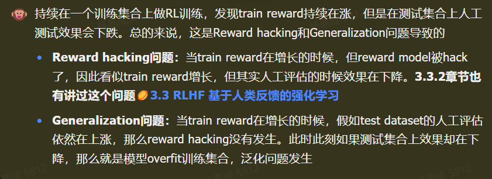

**Reward Hacking（奖励黑客 / 奖励欺骗）**：强化学习中，AI / 智能体**钻奖励函数的空子**，用非预期、甚至有害的方式最大化奖励，却**没完成真实目标**。

AI 做的是**你写的奖励函数**，不是**你真正想要的结果**

##### 本质是**==目标与奖励的错==位**：奖励是真实目标的**不完美代理**，AI 作为强力优化器，必然会找到并放大这个错位。

# ==3.3.5 SFT 与 RLHF 的本质区别==

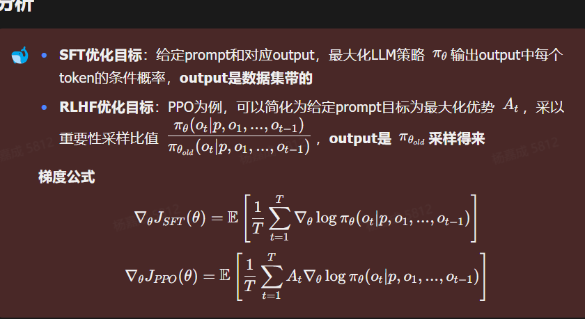

- SFT本质上在进行**模仿学习**，且所有token对应的**梯度系数为1**，对策略优化的贡献相同
- RLHF-PPO本质上是在进行**探索和利用**，通过自身采样得到输出样本，然后**利用优势函数评判当前动作相对平均动作的价值,调整策略优化的方向和幅度**，优势的正负代表方向，绝对值代表幅度，梯度系数为$A_t$  
- PPO梯度推导见文档

### 本质区别（一句话版）

- **SFT：监督模仿学习，照着标准答案学**
- **RLHF-PPO：强化学习，自己采样→打分→改策略**

### 结论（最本质）

- **SFT = 模仿学习**
  - 学人类标注
  - 所有 token 梯度权重 = 1
  - 无探索、无反馈、无偏好
- **RLHF-PPO = 强化学习（探索 + 利用）**
  - 模型自己采样输出
  - 用优势函数 *A_t* 评判好坏
  - ***$A_t>0 $拉高概率，$A_t<0 $ 压低概率**
  - 梯度系数 = $r_t(θ) * A_t$，**不同 token 权重不一样**

# 3.3.6 RLAIF 基于AI反馈的强化学习

**基于AI反馈（RLAIF）的强化学习，通过使用LLM来生成反馈信号来扩展RLHF范式**。这种方法可以补充或替代人类反馈，在人类标注稀缺、昂贵或不一致的任务中提供更可扩展的低成本偏好数据

**==RLHF和RLAIF之间的关键区别在于反馈的来源==：RLHF取决于人类生成的偏好，而RLAIF使用AI生成的反馈来指导策略更新。**RLAIF可以实现与RLHF相当甚至优于RLHF的性能（<u>其实现在大部分偏好标签都会通过蒸馏GPT、Claude、Gemini等强模型来生成</u>）    

**==AI feedback collect==**：LLM基于预先定义的标准（Prompt）生成反馈标签，标准可以包括特定于任务的指标、response的长度等

豆包：

RLAIF（AI 反馈强化学习）用**大模型替代人工**生成偏好数据、训练强化学习，核心是**省人力、提速度**。

- **核心思路**：不靠人工标注偏好，直接让 LLM 生成 / 标注训练数据，再用这些数据做 RL 训练。
- **优点**：大幅降低对人工标注的依赖，适合标注资源少、工期紧的场景，加快模型训练与上线。
- 问题
  1. **数据质量不稳**：LLM 可能生成错误、不一致的偏好数据，影响最终效果。
  2. **计算成本高**：要用能力强的大模型做数据生成 / 标注，算力与接口成本更高。

一句话：用 AI 省标注人力，但要付出**数据质量把控**和**算力成本**的代价。

# ==3.3.7 GRPO==

**Group Relative Policy Optimization**    

论文：DeepSeekMath: Pushing the Limits of Mathematical Reasoning in Open Language Models

链接：https://arxiv.org/pdf/2402.03300    

回顾一下PPO算法，我们为了计算`Actor_loss`要用到Reference、Reward和Value三个model，**其中Reference model参与KL reward的计算，Reward和Value model参与GAE的计算**

PPO作为一种Online强化学习算法，**需要大模型在与环境（一些questions）的交互（根据question输出answer）中进行采样和策略更新**，训练过程中需要**四个模型Actor、Critic、Reward和Reference Model**，==其中Reward model是提前训练好的，PPO过程中只有Actor和Critic需要训练，Reward和Reference只推理==。<u>四个模型带来的训练推理资源需求巨大，再加上PPO作为一种on-policy强化学习算法本身训练就不太稳定，一些工作试图对大模型RLHF-PPO算法进行改进</u>

## 对PPO优化的思考

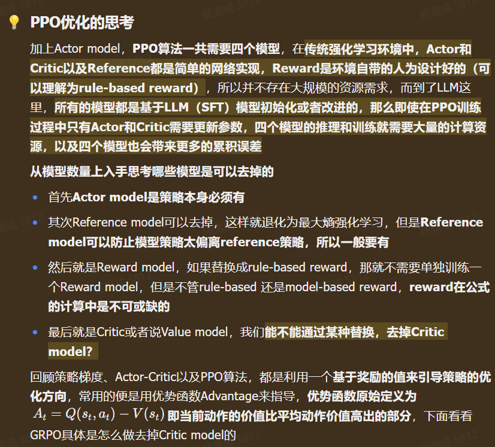

==**我们能不能通过某种替换，去掉Critic model**？==

## GRPO的优势函数估计

#### 总结

1. GRPO 的优势函数估计是**基于批量采样的简化版计算**：用一组输出的平均奖励估计价值函数，单个输出奖励减平均值得到优势，再归一化；
2. 合理性源于 ORM 的 “单步奖励” 设定，批量采样足够多时，平均值能有效近似价值函数的期望；
3. **核心特点是将整体输出的优势值广播到每个 token，统一调整同一输出内所有 token 的更新方向 / 幅度。**

### ORM 结果奖励监督RL

#### 先理清基础概念

- **ORM（Outcome Reward Model）**：本质是「只看最终结果给奖励」的奖励模型 —— 模型生成一组输出（比如多个回答），每个输出对应一个最终的奖励值*$r_i$*（比如回答质量分），没有中间步骤的奖励。
- **优势函数（Advantage Function）**：强化学习中核心概念，本质是「做某个动作的收益 - 平均收益」，用来衡量 “这个动作比随便选的动作好多少”，公式通常是*A*(*s*,*a*)=*Q*(*s*,*a*)−*V*(*s*)（动作价值 - 状态价值）。
- **价值函数V(s)**：强化学习中，状态*s*的价值是 “从这个状态出发，未来能拿到的总奖励的期望（平均值）”。

#### 总结

1. ORM 下优势函数简化为$r_i−rˉ$的核心：ORM 是「一步决策」，动作价值 = 单个输出的最终奖励，状态价值 = 所有输出的平均奖励，优势函数自然是两者的差值；
2. 归一化（除以*σ*）的目的：稳定优势值的尺度，避免奖励值波动影响策略更新；
3. **广播优势值**到每个 token 的原因：ORM 只有整体奖励，无 token 级奖励，只能将整体优势作为每个 token 的更新依据，确保整段输出的生成策略统一调整。

### PRM 过程奖励监督RL

#### 一句话核心

**PRM（Process Reward Model）不是只给整段答案打分，而是给每一步推理都打分；
再把这些 “步骤奖励” 整合起来，当成强化学习的信号，用 GRPO 去更新策略。**

#### 最精炼总结

**PRM + RL = 用 “步骤级奖励” 代替 “最终奖励” 做强化学习；
搭配 GRPO = 用组内相对优势做轻量、稳定的策略更新。**

#### GRPO整体更新公式和代码详见文档

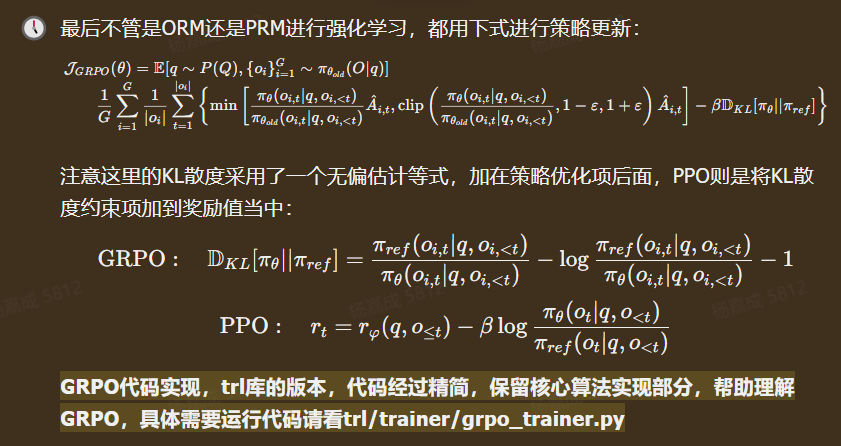

### GRPO代码的小问题

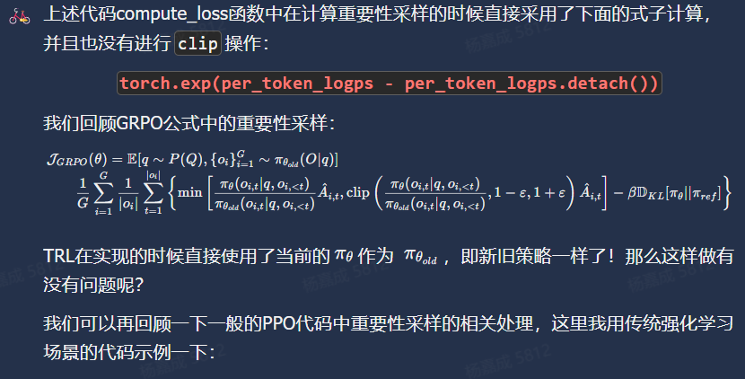

#### 总结

1. GRPO 的核心问题：**错误地将 “当前策略的 detach 版本” 当成 “旧策略”**，而非 “采集样本时的固定旧策略”，导致重要性采样的 ratio 失去了 “评估新旧策略差异” 的意义，始终≈1；
2. 无 clip 的副作用：即使 ratio 有微小波动，也无法限制其极端值，加剧训练不稳定性；
3. 对比传统 PPO：传统 PPO 的 old_logp 是 “更新前的固定值”，多 epoch 更新中 ratio 会变化，clip 则是关键的稳定机制，而 GRPO 的写法完全舍弃了这一核心设计。

不过这个问题最近得到了一些修正，现在去看TRL的源码，已经加上了num_iterations参数和一些其他改动，下面只看一下计算loss的时候的改动，其他具体改动参考 TRL 库 2025.2.21号的 Commit e5ae703    https://github.com/huggingface/trl/commit/e5ae703d352b29537159180087ef8bd4b41bf625    可以看到多步更新和clip操作都更新上去了

## ==实际训练中的问题及解法==

### ==GRPO训练时为什么会产生大量的重复内容==

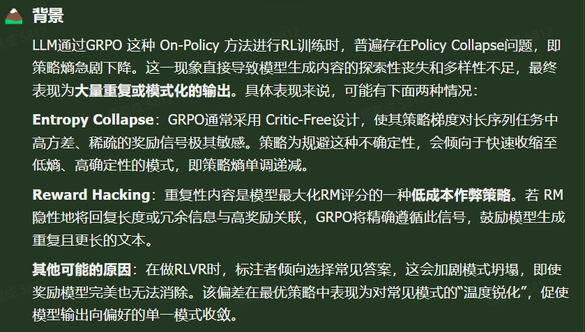

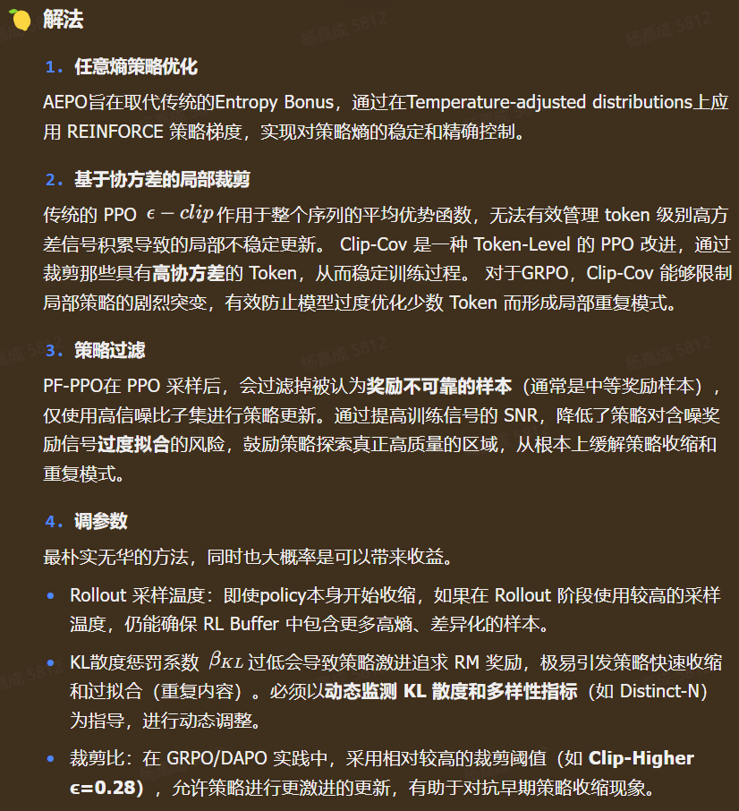

### GRPO 训练为什么会疯狂重复？

一句话：
**GRPO 是无 Critic 的在线策略 RL，对奖励信号太敏感、熵掉得太快，模型很快学会 “偷懒作弊”—— 重复就能拿高分，于是彻底锁死在单一模式里。**

1. **无 Critic 缓冲，奖励直接驱动梯度**
   - PPO 靠 Critic 估计状态价值（V），把**绝对奖励**转成**优势（A=R-V）**，能过滤奖励噪声、平滑信号。
   - GRPO 无 Critic，**奖励 R 直接参与优势计算**（A=R−组均值），**无价值估计做 “降噪 / 缓冲”**，奖励的微小波动、噪声、异常值会直接放大到梯度里。
2. **KL 惩罚不足 + 在线更新激进**
   - 虽有 KL 惩罚约束策略偏离参考，但**组内相对目标优先级更高**；在线更新激进，**策略快速固化**，**熵（生成多样性）快速崩塌**。

### 极简拆解（只讲关键）

1. **熵崩塌（Entropy Collapse）**
   GRPO 没有 Critic 来稳定梯度，奖励又稀疏、方差大。
   模型为了 “稳”，会**快速收敛到最确定、最低熵的输出**，多样性直接没了。
2. **Reward Hacking（奖励作弊）**
   奖励模型 RM 经常暗戳戳偏好：
   长一点、啰嗦一点、格式固定一点 = 分更高。
   GRPO 会精准学到：**重复、套话、加长文本 = 低成本拿高分**。
3. **数据 / 偏好偏差**
   人工偏好、RLHF 里大家都选常见答案，模型会**向最普通的答案收敛**，变成复读机。

------

### 为什么这些解法能治重复？

也极简说：

- **AEPO**：强行稳住策略熵，不让多样性掉光。
- **Clip-Cov**：在 token 级别控梯度，不让模型疯狂锁死某几个重复词。
- **策略过滤**：只用好样本更新，不让噪声奖励带偏模型。（PF-PPO（Policy Filtration for Proximal Policy Optimization，**策略过滤型近端策略优化**）是面向**大模型 RLHF 对齐**的改进版 PPO，核心是**过滤不可靠奖励样本、提升训练信噪比**）
- **调参**
  - 提高 rollout 温度 → 保持探索
  - 调大 KL 惩罚 → 不让策略疯跑
  - 调高裁剪比 → 防止过早收缩

------

### 最终超简总结

**GRPO 容易重复，本质就是：
无 Critic → 熵掉太快 + 奖励信号敏感 → 模型学会低成本重复作弊。
解法全是围绕：稳住熵、稳住梯度、稳住奖励信噪比。**

## GRPO vs PPO 极简对比整理

### 一、核心差异

| 对比项   | PPO                         | GRPO                                   |
| -------- | --------------------------- | -------------------------------------- |
| 结构     | 有 Actor + Critic（双网络） | 只有 Actor，**无 Critic**              |
| 优势计算 | 优势 = 奖励 − 价值估计（V） | 优势 = 奖励 − **组内均值**（相对奖励） |
| 策略更新 | 离线 / 近离线，有经验缓冲   | **纯在线策略**，无回放                 |
| 训练目标 | clip 约束，稳定更新         | 组内相对优势 + KL 惩罚                 |
| 依赖信号 | 对奖励不敏感，Critic 做平滑 | **直接依赖原始奖励**                   |

------

### 二、PPO 优缺点

**优点**

- 有 Critic，**对奖励噪声不敏感**，训练稳
- 探索更持久，**熵下降慢**，不易过早收敛
- 工业界成熟，适用场景广

**缺点**

- 双网络，实现更复杂
- 要训练价值函数，调参更多

------

### 三、GRPO 优缺点

**优点**

- 结构极简，易实现
- 无 Critic，计算开销小
- 适合偏好对齐、RLHF 类生成任务

**缺点**

- **对奖励信号极度敏感**，噪声影响大
- **熵掉得快**，容易塌探索、过早收敛
- 纯在线更新，稳定性差

------

### 四、一句话总结

- **PPO：稳、通用、复杂**
- **GRPO：简单、轻量、但敏感 + 易熵崩**

# 3.3.8 ReMax

### ==策略梯度与PPO回顾==

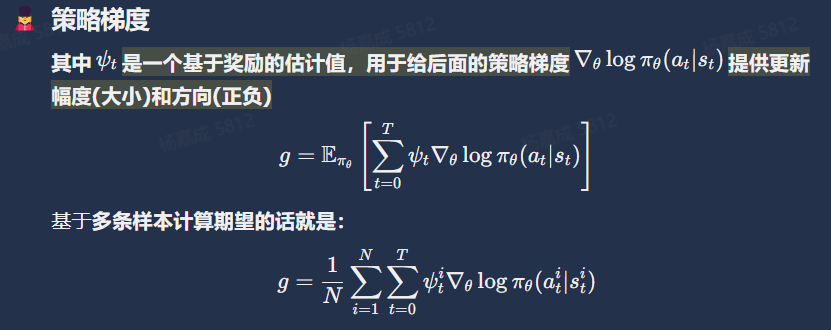

####  策略梯度

- 策略梯度本质：**沿着能让奖励变大的方向更新策略**。
- 里面的核心系数：**优势 / 回报值**，用来给梯度**定方向（正负）和大小（幅度）**。

多条轨迹求期望，就是对**轨迹回报**做平均梯度。

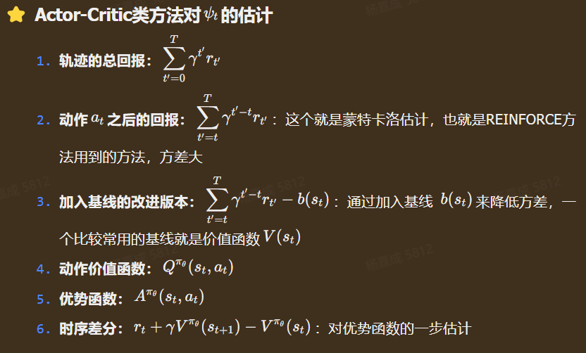

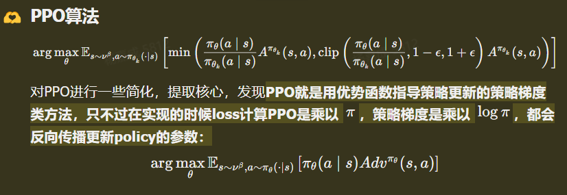

PPO 就是**带 “clip 约束” 的策略梯度**，核心还是**用优势函数$ A_t$指导策略更新**。

区别只在 loss 形式：

一句话总结：
**PPO = 策略梯度 + 优势函数A (s,a) + 重要性采样IS + clip 限制更新步长**。

在**策略梯度 / PPO**里：

- 用**优势函数**告诉算法：哪些动作值得提升
- 用**重要性采样**保证：用旧数据更新新策略时，**估计无偏、训练稳定**

### ==组合逻辑（PPO 核心）==

这四个概念的组合就是 PPO（近端策略优化）的核心：

1. 用**策略梯度**作为优化框架，直接优化策略；
2. 用**优势函数**降低梯度方差，提升训练稳定性；
3. 用**重要性采样**复用旧数据，提升数据效率；
4. 用**clip**限制策略更新幅度，避免策略突变，保证训练安全。

## ReMax具体算法

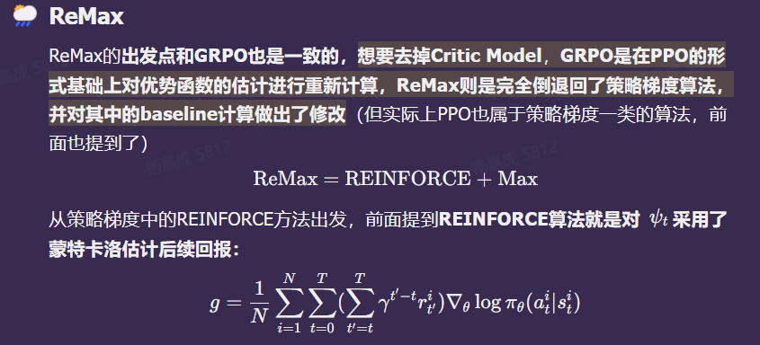

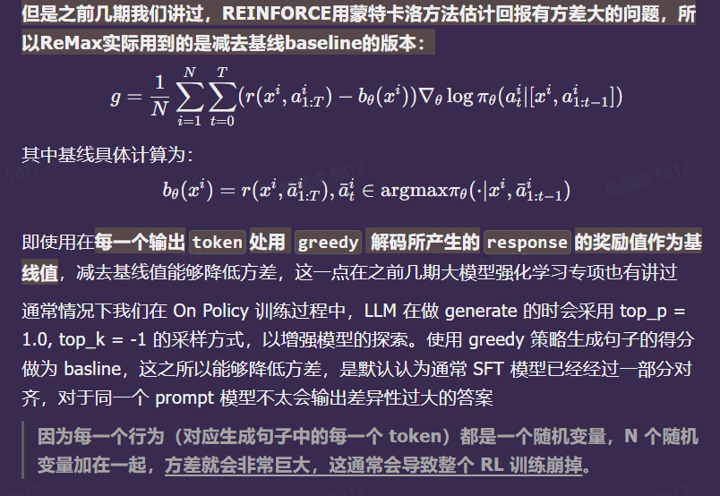

##### 一句话定位：

**ReMax = 回到最原始的策略梯度（REINFORCE），只改了 baseline，去掉 Critic，专门给大模型 RLHF 用。**

> (
>
> REINFORCE 是**基于蒙特卡洛的回合制策略梯度算法**，核心是**直接用梯度上升最大化累积回报**，让策略往奖励更高的方向更新。
>
> ##### 特点
>
> - 无价值函数、无 Q 网络，**纯策略梯度**
> - 蒙特卡洛采样：必须跑完一整局才能更新
> - 方差大、训练不稳定
> - 是所有策略梯度（A2C、PPO 等）的**基础原型**
>
> )

##### 最终超简总结

ReMax = 无 Critic、无 PPO、纯策略梯度

- 用贪心生成的奖励做固定 baseline
  = 简单、轻量、适合大模型对齐的低方差 RL 算法。

# (3.3.9 RLOO)

**RLOO（REINFORCE Leave-One-Out）** 是大模型强化学习对齐（RLHF）的轻量算法，核心是**用批次内其他样本的平均奖励做基线、把整段回复当单个动作、去掉 Critic 模型**，比 PPO 更省显存、更快收敛。

### 核心定义与原理

- 全称：**REINFORCE Leave-One-Out**（留一法强化学习）
- 定位：**PPO 的轻量替代**，属于在线 RLHF 算法
- 核心改进（一句话）：
  对每个样本，用**批次内其他所有样本的平均奖励**作为基线（而非全局平均），计算优势函数：
- 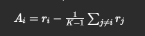
  再用 REINFORCE 更新策略，**全程不需要训练价值模型（Critic)**

### 与 PPO 的核心区别

| 对比项             | PPO                     | RLOO                       |
| ------------------ | ----------------------- | -------------------------- |
| 动作粒度           | 逐 token（token-level） | 整段回复（response-level） |
| 价值模型（Critic） | 必须训练                | 完全不需要                 |
| 基线来源           | 全局移动平均 / 价值估计 | 批次内**留一**平均         |
| 显存占用           | 高（多模型 + 大批次）   | 低（仅 3 个模型副本）      |
| 训练速度           | 慢                      | 快 2–3 倍                  |
| 实现复杂度         | 高（多阶段、调参多）    | 低（单阶段、易部署）       |

### 适用场景

- 大模型对话、指令遵循、数学推理等**生成式对齐任务**
- 显存有限、追求**训练效率**与**稳定性**的场景
- 替代 PPO 做轻量 RLHF，或与 DPO/GRPO 组合使用

# (3.3.10 REINFORCE++)

**REINFORCE++** 是经典 REINFORCE 策略梯度算法的强化版，专为大模型 RLHF 对齐设计，**无 Critic、更简洁、更稳、计算更省**。

### 核心定位

- 基于**策略梯度**，继承 REINFORCE 无偏性，**去掉 Critic 网络**，大幅降低计算开销。
- 融合 PPO 关键稳定技巧，目标：**简单、稳定、高效**。
- 主要用于 LLM 对齐，解决传统 REINFORCE 方差大、训练不稳、奖励 Hacking 等问题。

# 3.3.11 DAPO

1. **DAPO 是什么**
   - 字节开源的**大规模大模型强化学习系统**
   - 基于 **DeepSeek GRPO** 算法改进
   - 聚焦解决两大问题：
     - 探索与利用的平衡
     - 奖励设计
   - 全称：
     **Decoupled Clip and Dynamic sAmpling Policy Optimization**
2. **DAPO 的核心思路**
   在 GRPO 基础上做了**四项关键技术改进**

## ==四项关键技术改进（在 GRPO 基础上）

1. Clip-Higher（解耦剪切）

   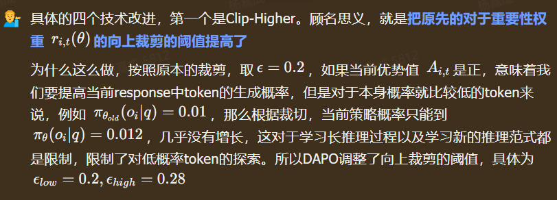

   - GRPO 问题：对称剪切（1-ε~1+ε）限制低概率 token 探索，易熵崩溃。
   - DAPO 改进：**解耦上下剪切界（ε_low/ε_high），放宽上界**，给低概率但有价值的 token 更大提升空间，防过早确定化。

2. Dynamic Sampling（动态采样）

   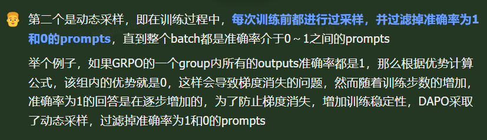

   - GRPO 问题：全对 / 全错样本优势为 0，梯度消失、样本效率低。
   - DAPO 改进：**过滤准确率 0 或 1 的无效样本**，只保留有有效梯度的样本，提升训练稳定性与效率。

3. Token-Level Policy Gradient Loss（Token 级策略梯度损失）

   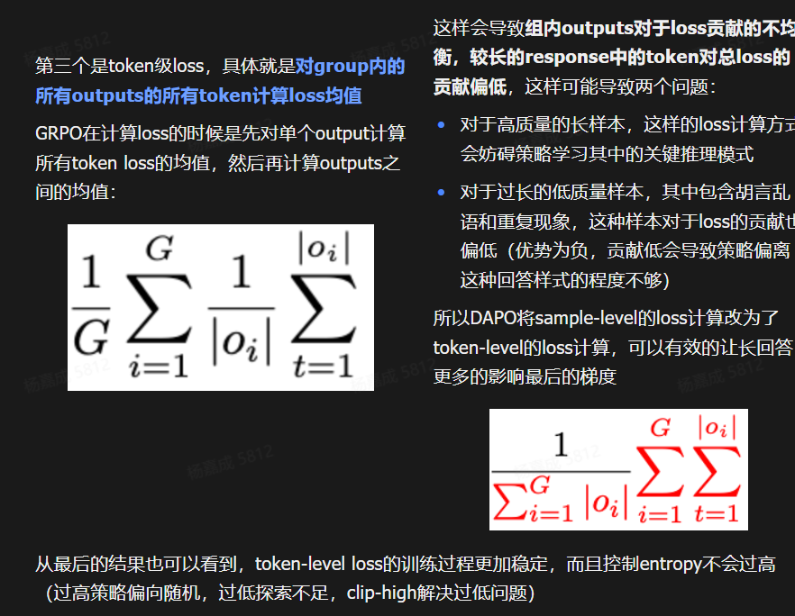

   - GRPO 问题：样本级损失（先样本内 token 平均、再跨样本平均）导致长序列梯度稀释，错误易积累。
   - DAPO 改进：**按 Token 计算损失并加权求和**，强化长推理链中每个步骤的梯度贡献，提升长文本质量。(**对group内的所有outputs的所有token计算loss均值**)

4. Overlong Reward Shaping（过长奖励塑形）

   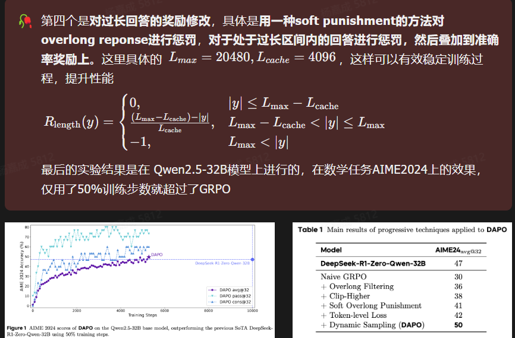

   - GRPO 问题：超长响应截断引入奖励噪声，正确推理易被误判。
   - DAPO 改进：**长度感知的软惩罚机制**，对超长度响应按超出程度分级惩罚，降低噪声、引导简洁推理。
   - 是**对过长回答的奖励修改**，具体是**用一种soft punishment的方法对overlong reponse进行惩罚，对于处于过长区间内的回答进行惩罚，然后叠加到准确率奖励上**。

------

一句话总结：
**DAPO 是字节在 GRPO 之上，专门为大模型 RL 做的、更稳更高效的策略优化算法，重点解决探索 - 利用平衡与奖励设计问题**

# 3.3.12 VAPO

论文：VAPO: Efficient and Reliable Reinforcement Learning forAdvanced Reasoning Tasks    链接: https://arxiv.org/pdf/2504.05118

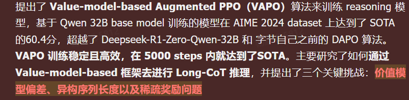

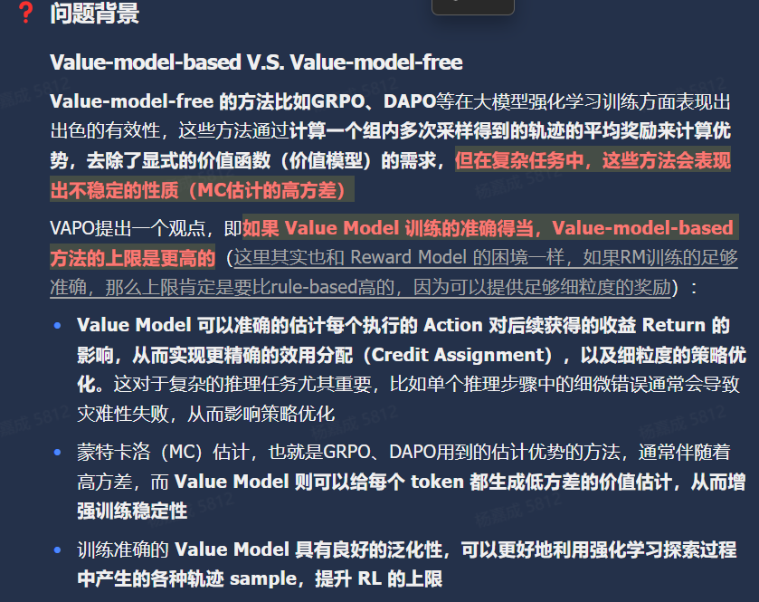

## 豆包总结：

VAPO 是字节跳动 Seed 团队提出的**基于价值模型增强的 PPO 框架**，专为**长链推理（Long-CoT）** 设计，核心解决价值模型偏差、异构序列长度、稀疏奖励三大痛点，在数学推理基准上实现高效稳定的 SOTA。

------

### 核心定位与性能

- 全称：Value-model-based Augmented PPO。
- 基座：**Qwen 2.5-32B Base**（无 SFT 数据）。
- 指标：**AIME 2024 达 60.4 分**，较 DeepSeek-R1（47 分）、字节 DAPO（50 分）领先超 10 分。
- 效率：**5000 步内**达 SOTA，训练无崩溃，稳定性显著。

### 三大挑战与核心解法

1. **价值模型偏差**
   用**价值预训练**（固定策略采样 + 蒙特卡洛回报训练至低损失）与**解耦 GAE**（价值更新 λ=1.0，策略更新 λ 更小），消除初始化偏差、缓解长序列奖励衰减。
2. **异构序列长度**
   提出**长度自适应 GAE**，按序列长度动态调整 λ（长序列 λ≈1.0，短序列 λ 更小），平衡偏差 - 方差，统一长短序列的优势估计；搭配**Token 级策略梯度损失**，避免长序列中 Token 贡献被稀释。
3. **稀疏奖励**
   集成**Clip-Higher**（扩大高概率剪切范围，防止采样空间坍塌）、**正样本 LM 损失**（强化正确样本学习）与**分组采样**（集中学习优质样本），提升稀疏奖励下的学习效率。

### 关键整合与意义

- 整合 DAPO 的 Clip-Higher/Token 级损失、VC-PPO 的价值预训练 / 解耦 GAE 等，经消融验证各组件必要性。
- 首次让**基于价值的 RL**在长 CoT 任务上显著超越无价值方法，为复杂推理的 RL 微调提供新基准。

# 3.3.13 TTRL

论文：TTRL: Test-Time Reinforcement Learning    

链接：https://arxiv.org/pdf/2504.16084    

主要思想是**利用测试时扩展（Test-Time Scaling，TTS）产生的无标注数据（比如测试数据不给ground truth）进行多数投票（Majority Vote）自动计算奖励来进行强化学习优化**，驱动模型的自提升 

## 豆包总结

TTRL（Test-Time Reinforcement Learning）是**测试时强化学习**，核心是在无标注测试阶段，用**测试时扩展（TTS）** 生成多候选，以**多数投票共识**自动造奖励，驱动模型在线自优化。

### 核心流程

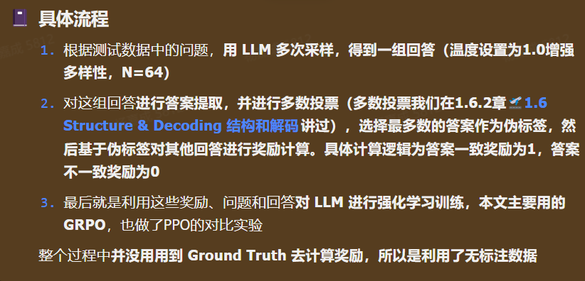

1. **测试时扩展（TTS）**：对每个测试输入，用当前模型采样 K 个推理轨迹 / 候选输出，形成无标注样本池。
2. **多数投票造奖励**：以 “共识即正确” 为假设，对 K 个输出做多数投票，得共识结果；将与共识一致的轨迹赋高奖励，不一致的赋低奖励，生成**规则化奖励信号**。
3. **RL 在线更新**：把测试样本当经验，用强化学习（如策略梯度）更新模型参数，实现测试阶段的**持续自提升**。

### 关键价值

- **无标注自进化**：无需人工标注，仅靠模型自身生成的共识信号完成优化。
- **性能显著**：如 Qwen2.5-Math-7B 在 AIME 2024 上相对提升 159%，逼近有标注训练的上限。
- **轻量易集成**：核心逻辑约 20 行代码即可实现，适配多数生成式模型。

### 一句话总结

TTRL 让模型在测试时 “自己出多份答案、少数服从多数判对错、用 RL 改自己”，实现无监督的在线自我增强。

# 3.3.14 GSPO

论文：Group Sequence Policy Optimization    链接: https://arxiv.org/pdf/2507.18071    **Qwen 团队出品大模型强化学习算法 GSPO，Group Sequence Policy Optimization**    

字面意思就是 **==组序列策略优化==**，很明显是要把之前 PPO / GRPO 的 token level 优化，变成序列为单位的优化

GSPO 是阿里 Qwen 团队提出的大模型强化学习优化算法，核心是将 PPO/GRPO 的**token 级**优化升级为**序列级**优化，解决了传统算法训练大模型（尤其是 MoE 稀疏模型）时的稳定性差、易崩溃问题，同时提升了训练效率，也是 Qwen3 模型性能提升的关键技术。

## RL for LLM 中的 Action 建模问题

**可以看到有一个明显的问题就是，action 和 reward 的单位并不匹配**

### 一、RL for LLM 里的核心矛盾：**Action 与 Reward 单位不匹配**

- 传统 RLHF / PPO / GRPO 里：
  - **Action = 下一个 token**（token 级动作）
  - **Reward = 整段回复好坏**（序列级奖励）
- 这就造成：
  **动作细、奖励粗 → 单位天然不对齐 → 稀疏奖励 + credit assignment 困难**

------

### 二、PPO 是怎么处理的？

- 把**中间 token 的奖励当成 0**，只在序列末尾给真实奖励。
- 用 **value model + 优势函数** 把序列奖励 “摊” 到每个 token。
- 最终：
  **优化目标（token 级策略） ≈ 优势函数单位**
  勉强对齐，但本质还是**稀疏奖励 + 单样本重要性采样**。

------

### 三、GRPO 的问题（你原文的核心）

GRPO 去掉了价值模型，直接：

1. 用**序列级 reward**
2. 把优势函数**广播到每个 token**
3. 在**每个 token 上算重要性权重**

但这里有致命问题：

- **重要性采样需要多样本平均，GRPO/PPO 在 token 级只有 1 个样本**
- 单样本权重 → **极高方差**
- 再叠上 **token 级 clip** → 误差在长序列上**不断累积、放大**
- 最终：
  **梯度噪声爆炸 → 训练不稳定 → 模型可能不可逆崩溃**

------

### 四、GSPO 怎么解决？一句话

**把 Action 从 token 级改成 序列级，让动作和奖励单位直接对齐。**

具体：

- 不再把每个 token 当独立 action
- **把整个 response 当作一个 action**
- 重要性权重直接在**序列级**计算与裁剪
- 用**几何平均**把序列权重归一化，让所有 token 共享同一个稳定权重

效果：

- 消除 token 间权重差异
- 消除长序列误差累积
- 训练更稳，不易崩

------

### 五、整段内容的终极总结（最精简版）

1. **RL for LLM 原生问题**：token 动作 vs 序列奖励，单位不匹配。
2. **PPO**：用价值模型摊奖励，勉强对齐，但仍稀疏。
3. **GRPO**：无价值模型，但**token 级重要性采样单样本、高方差、长序列崩**。
4. **GSPO**：直接升维到**序列级动作 + 序列级权重**，从根源对齐单位，稳定训练。

##  ==PPO → GRPO → GSPO 的演进图一页纸对比总表==

| 维度         | PPO            | GRPO             | GSPO                   |
| ------------ | -------------- | ---------------- | ---------------------- |
| Action 粒度  | token          | token            | **序列**               |
| Reward 粒度  | 序列           | 序列             | 序列                   |
| 价值网络     | 需要           | **无**           | 无                     |
| 重要性采样   | token 级       | token 级         | **序列级（几何平均）** |
| Clip 位置    | 逐 token       | 逐 token         | **整序列一次**         |
| 单位匹配     | 勉强对齐       | **不匹配**       | **完美匹配**           |
| 长序列稳定性 | 一般           | 差（易崩）       | **优秀**               |
| 核心贡献     | 标准 RLHF 框架 | 轻量、无价值网络 | **从建模根除不匹配**   |

------

####  演进一句话总结

1. **PPO**：token 动作 + 价值网络摊奖励 → 能用但重
2. **GRPO**：去掉价值网络，但**依旧 token 级 IS** → 快但不稳
3. **GSPO**：**升维到序列级动作 + 序列级 IS** → 又轻又稳

# 3.3.15 ASPO

论文：ASPO: Asymmetric Importance Sampling Policy Optimization    链接：https://arxiv.org/pdf/2510.06062    

快手与清华联合出品，字面意义理解为 **非对称重要性采样** 策略优化，通过对优势值为正的 token 的重要性权重进行上下翻转，平衡探索与利用，缓解 **熵坍缩** 现象，减少过拟合倾向

## 重要性采样是什么？

重要性采样，就是**在做蒙特卡洛积分 / 期望估计时，换一个更容易采样的分布来算，再用权重修正偏差**。

一句话：

- 本来要从 *p*(*x*) 采样算期望，但 *p* 难采、方差大。
- 改成从**好采样**的 *q*(*x*) 采样。
- 每个样本乘**重要性权重**：*w*(*x*)=*q*(*x*)/*p*(*x*)。
- 用带权平均代替原本的期望，从而**用更少样本、更低方差**得到准确结果。

核心：**换分布采样，用权重还原真实期望**。

## ==为什么需要重要性采样？==

核心一句话：
**为了让 “旧策略采的样本” 能用来更新 “新策略”，把 off-policy 变成合法可用。**

**所以重要性采样的作用主要是**：    

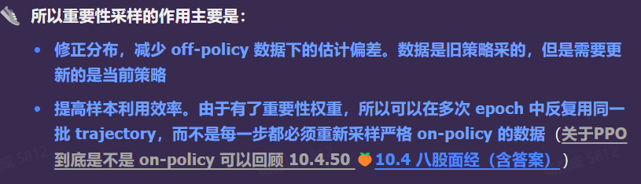

**重要性采样（IS）在强化学习里的作用就两点：**

1. **纠偏**：用重要性权重，把「旧策略采的数据」变成「能用来估计当前策略」的无偏估计，解决 off-policy 带来的分布不匹配问题。
2. **省样本**：允许**复用旧轨迹、多轮 epoch 训练**，不用每步都重新跑环境采 on-policy 数据，大幅提升样本效率。

一句话概括：
**让 off-policy 数据能安全、高效地用来更新当前策略。**

## ==不同Clip策略的效果：==

### 一、PPO / GRPO 原始 clip（硬裁剪）

- 核心：把**重要性权重 r** 限制在 `[1-ε, 1+ε]` 之间。
- 效果：
  - 好动作：不让概率涨太猛
  - 坏动作：不让概率跌太猛
- 问题：
  - **超过区间直接梯度清零**（ PPO/GRPO 的 clip 会连同梯度一起裁剪掉，导致关键 token梯度不参与后续多 epoch 的 off-policy 训练，样本效率降低）
  - 本来概率就低的关键 token（如反思、Aha 类），一被 RL 推高就立刻触发上界裁剪，**梯度直接丢了**，多 epoch 离线训练也用不上这些样本。

一句话：**硬切，超界就没梯度。**

------

### 二、Dual-clip PPO（双边硬裁剪）

- 解决：分布式训练里

  轨迹很旧、很 off-policy （用**别的策略**产生的数据，来**更新当前策略**）时：

  - 旧策略很小、新策略很大 → IS 巨大
  - 优势函数又为负 → 梯度会爆，训练崩

- 做法：

  - 再加一个**下界裁剪**，把极端负权重也掐住

- 效果：

  - 抑制极端大 / 极端负的 IS 带来的**梯度爆炸与方差爆炸**
  - 更稳，但依然是**硬 clip，超界梯度消失**。

一句话：**更稳，但还是硬切，梯度照样丢。**

------

### 三、CISPO soft clip（软裁剪）

- 解决：PPO/GRPO 一 clip 就**丢梯度、样本效率低**。
- 思路：
  - 回到 REINFORCE（**REINFORCE** 是强化学习中最经典的**蒙特卡洛策略梯度算法**，核心是**直接用完整轨迹的回报更新策略参数**，无模型、无偏但方差高。）
  - 把 IS 权重**只限制大小，不切断依赖**
  - 不用硬截断到 0，而是**压到一个上限**
- 效果：
  - 就算权重超了，也只是**变成有限值**（==CISPO 是只限制权重大小，不把 token 从梯度里踢出去，所以叫soft clip 软裁剪==  ）
  - **梯度永远存在**，不会清零
  - 被 clip 的样本依然能继续训练，**off-policy 多 epoch 更高效**

一句话：**只限权重大小，不踢掉 token 梯度，软约束。**

------

### 极简总结

- **PPO/GRPO clip**：硬切，超界→梯度 = 0
- **Dual-clip**：双边硬切，更稳，但还是丢梯度
- **CISPO soft clip**：软限权重，**梯度一直保留**，样本利用率更高

 ASPO 针对 PPO 在实际应用中权重分配问题提出的非对称重要性采样（AIS）方法，包括 PPO 的原有问题、ASPO 的核心思路和实现步骤。我会用通俗易懂的方式帮你拆解这些核心逻辑。

## ASPO

### 一、先理清核心问题：PPO dual-clip 权重分配的 “不公平”

==首先要明确几个关键概念，方便理解：==

- **优势值 A**：A>0 代表这个动作是 “好动作”（收益高于平均），A<0 代表 “坏动作”（收益低于平均）；
- **重要性权重 r**：当前策略下动作概率 / 旧策略下动作概率，r>1 表示当前策略更 “偏爱” 这个动作，r<1 表示当前策略更 “冷落” 这个动作；
- **dual-clip**：PPO 为了限制权重极端值的常规操作，但只针对 A<0 的样本。

**==PPO 原有方案的核心问题==**出在**A>0（好动作）的样本权重分配上**：

1. **坏样本（A<0）**：权重分配是合理的 ——r 越大（当前策略越偏爱这个坏动作），负梯度越强，能 “拉回” 错误策略；r 越小（当前策略本就不选这个坏动作），负梯度越温和，符合预期。
2. **好样本（A>0**）**：权重分配完全 “反了”**——
   - r 越大（当前策略已经很偏爱这个好动作）：反而给更大的正向权重，导致 “自我强化”，训练不稳定、输出重复（熵崩溃）；
   - r 越小（当前策略还没重视这个好动作）：只给极小的权重，这个好动作的梯度信号几乎消失，学不到该学的内容。

简单说：PPO 对 “坏动作” 的修正很合理，但对 “好动作” 的强化搞反了 —— 越该学的（r 小的好动作）学得越少，越不该强化的（r 大的好动作）反而强化得越狠。

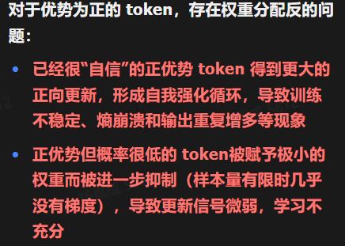

### 二、ASPO 的核心解法：非对称重要性采样（AIS）

ASPO 的核心思路是**让好样本（A>0）的权重分配逻辑和坏样本（A<0）保持一致**——“该重点学的给高权重，该克制的给低权重”，具体是对 A>0 的样本做 “权重翻转”：

- 原本 A>0 的样本，权重随 r 增大而增大（越偏爱越强化）；
- 翻转后，A>0 的样本，权重随 r 增大而减小（越偏爱越克制）、随 r 减小而增大（越冷落越重点学）。

### 三、ASPO 的三步实现细节（落地逻辑）

1. **第一步：Hard Clip 极端值**
   先把 r 超出合理范围的样本直接 mask 掉（比如 r 过大 / 过小，属于异常值），避免极端值干扰训练，这是基础的 “清洗” 步骤。

2. 第二步：翻转 A>0 样本的 IS 权重

   核心操作：对 A>0 的样本，把原本的权重 r（当前 / 旧）翻转为 1/r（旧 / 当前），这样：

   - r>1（当前偏爱这个好动作）→ 1/r < 1 → 权重变小，避免过度强化；
   - r<1（当前冷落这个好动作）→ 1/r> 1 → 权重变大，重点学习这个被忽略的好动作。

3. **第三步：对 A>0 样本补充 dual-clip**
   因为权重翻转后，A>0 样本的极端值位置从 “r 大的左上” 变成了 “r 小的右下”，所以需要像 A<0 样本一样，给 A>0 样本也加 dual-clip（用 CISPO 的 dual-clip 规则），进一步限制极端权重，保证训练稳定。

### ==总结==

1. **核心问题**：PPO 的 dual-clip 只处理 A<0 样本，导致 A>0 样本权重分配反向，好动作要么过度强化、要么学习不足；
2. **ASPO 核心**：对 A>0 样本做 “权重翻转”，让好样本的权重逻辑和坏样本一致（该学的重点学，该克制的少强化）；
3. **落地关键**：先清洗极端值，再翻转 A>0 的 IS 权重，最后给 A>0 样本补充 dual-clip，解决训练不稳定、熵崩溃、学习不充分的问题。

简单类比：PPO 教模型选好动作时，是 “越会选的越使劲教，越不会选的越不教”；ASPO 改成 “越不会选的越使劲教，越会选的适度提醒”，更符合学习规律。

