# 强化学习笔记

# chap3.1 RL基础

# 3.2.1 强化学习问题、流程以及独特性

## 强化学习解决的问题

在机器学习领域，有一类重要的任务和人生选择很相似，即**序贯决策（sequential decision making）任务**。==决策和预测任务不同，决策往往会带来“后果”，因此决策者需要为未来负责，在未来的时间点做出进一步的决策==。实现序贯决策的机器学习方法就是强化学习（reinforcement learning），**预测仅仅产生一个针对输入数据的信号，并期望它和未来可观测到的信号一致，这不会使未来情况发生任何改变**    

强化学习（Reinforcement Learning，RL）是一种机器学习方法，用于解决需要在一定环境下通过与环境交互来学习最优行为策略的问题。其核心思想是**==通过试错（Trial and Error）和奖励机制来指导智能体（Agent）学习如何在不同情境下采取行动，以最大化长期累积奖励==**    

应用场景：控制问题、游戏、资源管理优化、金融风险控制、推荐算法

## 强化学习流程

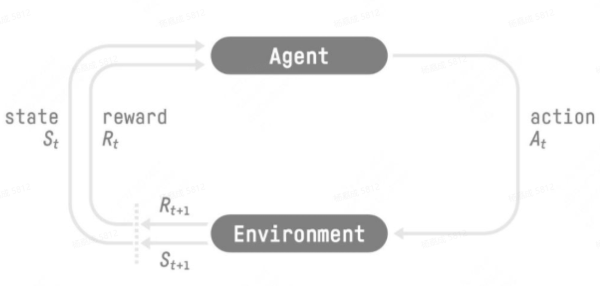

强化学习是机器通过与环境交互来实现目标的一种计算方法。机器和环境的一轮交互是指，机器在环境的一个状态下做一个动作决策，把这个动作作用到环境当中，环境发生相应的改变并且将相应的奖励反馈和下一轮状态传回机器。这种交互是迭代进行的，目标是**最大化在多轮交互过程中获得的累积奖励的期望**。强化学习用智能体（agent）这个概念来表示做决策的机器。相比于有监督学习中的“模型”，强化学习中的“智能体”强调机器不但可以感知周围的环境信息，可以通过做决策来直接改变这个环境，而不只是给出一些预测信号。**一般来说在经典的强化学习环境中agent的实现可以用一些简单的MLP、RNN、CNN等神经网络实现，与现在流行的LLM-based agent有区别**

**智能体在这个过程中学习，它的最终目标是：找到一个策略，这个策略根据当前观测到的环境状态和奖励反馈，来选择最佳的动作**

## ==强化学习的独特性==

对于一般的有监督学习任务，**目标是找到一个最优的模型函数，使其在训练数据集上最小化一个给定的损失函数**。

相比之下，**强化学习任务的最终优化目标是最大化智能体策略在和动态环境交互过程中的价值**。

- 有监督学习和强化学习的优化目标相似，**即都是在优化某个数据分布下的一个分数值的期望**。    

- 二者优化的**途径是不同**的，**有监督学习直接通过优化模型对于数据特征的输出来优化目标，即修改目标函数而数据分布不变；**
- **强化学习则通过改变策略来调整智能体和环境交互数据的分布，进而优化目标，即==修改数据分布而目标函数不变==**    

==综上所述==，一般有监督学习和强化学习的范式之间的区别为：

-  一般的**有监督学习关注寻找一个模型，使其在给定数据分布下得到的损失函数的期望最小**    
- **强化学习关注寻找一个智能体策略，使其在与动态环境交互的过程中产生最优的数据分布，即最大化该分布下一个给定奖励函数的期望**

### 豆包总结：

- **有监督学习**：
  给定一堆**现成标注好的数据**，目标是**学一个函数 / 模型**，让它在**固定数据分布**上，**预测误差尽可能小**。
  一句话：**在已有数据上，把损失降到最低。**
- **强化学习**：
  没有现成答案，智能体要**自己和环境互动、试错**，一边行动一边**产生新的数据分布**。
  目标是**找到最优策略**，让长期**奖励期望最大**。
  一句话：**在互动中造出最优数据分布，把奖励拿到最大。**

核心区别一句话总结：
**监督学习：用固定数据，最小化损失。
强化学习：边交互边造数据分布，最大化奖励。**

## ==强化学习与有监督学习的其他区别==

强化学习用智能体（agent）这个概念来表示做决策的机器。相比于有监督学习中的“模型”，强化学习中的“智能体”强调机器不但可以感知周围的环境信息，还可以通过做决策来直接改变这个环境，而不只是给出一些预测信号

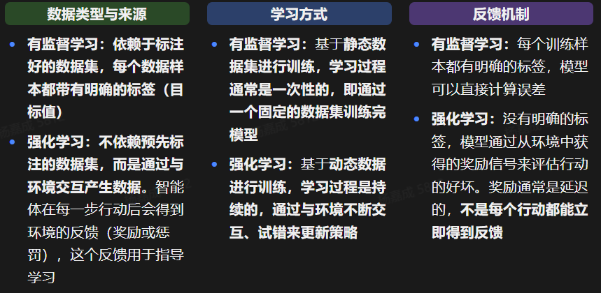

# 3.2.2 马尔可夫决策过程

数学推导见文档

### 关于马尔可夫性质    

==当且仅当某时刻的状态只取决于上一时刻的状态时，一个随机过程被称为具有马尔可夫性质Markov property==，也就是说，当前状态是未来的充分统计量，即下一个状态只取决于当前状态，而不会受到过去状态的影响。需要明确的是，**具有马尔可夫性并不代表这个随机过程就和历史完全没有关系。因为虽然时刻的状态只与时刻的状态有关，但是时刻的状态其实包含了时刻的状态的信息，通过这种链式的关系，历史的信息被传递到了现在**

一句话总结：
**在随机环境中，每一步只看当前状态选动作，追求长期收益最大化的决策模型。**

# 3.2.3 贝尔曼方程 Bellman Equation

一句话说清：
**贝尔曼方程 = 把 “长期最优决策” 拆成 “当下收益 + 未来最优收益”。**

极简解析：

1. 它是**强化学习 / 动态规划**的核心公式。

2. 目标：计算一个状态的**价值 V (s)**—— 从现在起一直到最后，总共能拿到多少收益。

3. 结构：

   *V*(*s*)=当下奖励*R*(*s*)+*γ*下一状态最优价值max*V*(*s*′)

   - *R*(*s*)：现在立刻得到的奖励
   - *γ*：折扣因子（未来没现在值钱）
   - max*V*(*s*′)：后面每一步都选最优

一句话总结：
**当前状态的总价值 = 现在赚的 + 未来能赚的最优值。**

# 3.2.4 蒙特卡洛方法

**蒙特卡洛方法（Monte-Carlo methods）**也被称为统计模拟方法，是一种基于概率统计的数值计算方法。

一句话说清：
**蒙特卡洛方法 = 用「大量随机抽样」来代替「精确计算」，从而近似求解问题的数值方法。**

# 3.2.5 动态规划方法

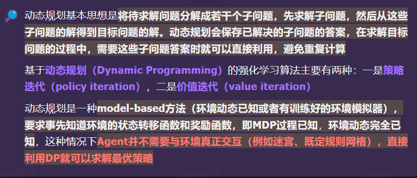

### 豆包总结：

#### 1. 动态规划（DP）核心思想

- 把**大问题拆成若干小问题**
- 先算小问题，**把结果存起来**
- 后面再用到时**直接查表，不重复算**

一句话：**分治 + 缓存 = 避免重复计算**。

------

#### 2. 基于 DP 的强化学习两大算法

1. **策略迭代（Policy Iteration）**
   - 先算当前策略的价值
   - 再改进策略
   - 反复迭代直到最优
2. **价值迭代（Value Iteration）**
   - 直接迭代最优价值函数
   - 最后从价值推出最优策略

------

#### 3. DP 在强化学习里的关键定位

- 属于 **model-based 方法**

- 要求：

  环境完全已知

  - 状态转移概率 P 已知
  - 奖励函数 R 已知
  - 也就是 MDP 已知

- 优点：**不用和环境真实交互**，纯计算就能得到最优策略

- 适用：迷宫、网格世界等**规则固定、动态已知**的环境

------

==一句话总结：==
**动态规划 = 拆分问题 + 存结果防重复计算；在强化学习里，它是环境完全已知时，用策略迭代 / 价值迭代算出最优策略的 model-based 方法。**

### 策略迭代算法 Policy Iteration

**策略迭代**是**强化学习中求解马尔可夫决策过程（MDP）最优策略**的经典算法，核心是**交替做两件事**：

1. **策略评估（Policy Evaluation）**
   固定当前策略，计算每个状态在该策略下的**价值函数 V (s)**。（策略评估的目的是计算策略的状态价值函数，有状态价值函数的贝尔曼期望方程）（**即利用上一个迭代的状态价值函数来计算当前迭代的状态价值函数**）
2. **策略改进（Policy Improvement）**
   用算出来的 V (s)，**贪心更新策略**：每个状态都选能让长期回报最大的动作。

------

#### 一句话流程

**评估 → 改进 → 再评估 → 再改进 → 直到策略不再变化**
此时得到的就是**最优策略**。

------

#### 核心特点

- 一定会**收敛到最优策略**
- 比价值迭代更 “稳”，通常迭代次数更少
- 本质：**策略空间里直接搜索最优策略**

价值迭代是**强化学习 / 马尔可夫决策过程（MDP）\**里，用来求\**最优策略**的动态规划算法。

核心一句话：
**反复更新每个状态的最优价值，直到收敛，再用价值反推出最优动作。**

------

### 价值迭代算法 Value Iteration

#### 1. 核心思想

- 对每个状态 *s*，算它的**最优价值** *V*∗(*s*)：从 *s* 出发，一直用最优动作，未来能拿到的**最大长期回报**。
- 用**贝尔曼最优方程**迭代：
  *V*(*s*)←max*a*​[*R*(*s*,*a*)+*γ*∑*s*′​*P*(*s*′∣*s*,*a*)*V*(*s*′)]
- 一直更新到 变化很小，就**收敛**了。

#### 2. 步骤（极简）

1. 随便给每个状态一个初始价值 *V*0(*s*)。
2. 对所有状态，用上面公式**同步更新**价值。
3. 重复直到价值几乎不变。
4. 最后对每个状态选：
   *π*∗​(*s*)=argmax*a*​[*R*(*s*,*a*)+*γ*∑*P**V*]
   就得到**最优策略**。

#### 3. 特点

- 一步到位：**价值 + 策略一起最优**。
- 比策略迭代少一步：不用单独做策略评估。
- 适合**状态不多**的 MDP。

### ==策略和价值对比==

#### 一、策略迭代（Policy Iteration）

核心思想：**先固定策略，再更新价值；价值稳了，再改进策略，循环直到收敛。**
两步循环：

1. **策略评估**：用当前策略，把每个状态的价值算准、算稳。
2. **策略提升**：用算好的价值，把每个状态的动作改成当前最优（贪心）。

特点：

- 一轮里要**多次迭代价值**，直到价值收敛。
- 策略通常**很快就收敛**，整体迭代次数少。

一句话：**先把价值算准，再把策略变好，反复做。**

------

#### 二、价值迭代（Value Iteration）

#### 核心思想：**不单独评估策略，直接一步把价值和最优动作一起更新。**

只有一步：

- 直接对每个状态，用**贝尔曼最优方程**更新价值：
  取 “能带来最大未来回报” 的那个动作，一步更新价值。

特点：

- 没有单独的 “策略评估”，**每轮只更新一次价值**。
- 收敛后，从价值里**直接提取最优策略**。

一句话：**直接迭代最优价值，最后再出策略。**

------

#### 极简对比

- 策略迭代：**策略评估 + 策略提升**，两步循环。
- 价值迭代：**一步到位更新最优价值**。

## 3.2.6 时序差分方法

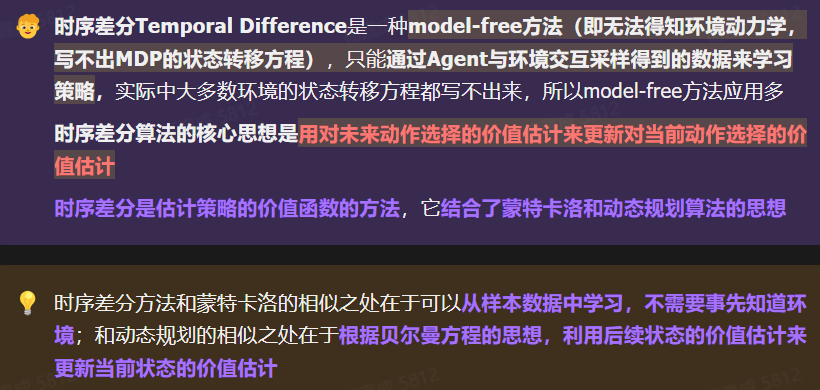

- **时序差分 TD 是 model-free 方法**：
  不用知道环境的状态转移概率，不靠 MDP 公式，只靠**智能体和环境交互的采样数据**来学习，因此现实中非常常用。
- **核心思想**：
  用**后续状态的价值估计**，去**更新当前状态的价值估计**。
- **本质定位**：
  是一种**估计价值函数**的方法，融合了两类思想：
  1. 像**蒙特卡洛**：从经验样本学习，不用环境模型。
  2. 像**动态规划**：用贝尔曼方程思想，靠后续状态的估计值来更新当前值。

一句话总结：
**时序差分 = 蒙特卡洛的采样学习 + 动态规划的自举更新**

### SARSA/SARSA-λ/Q-learning见文档

这三个都是**时序差分（TD）强化学习**里的经典**在线策略/离线策略**算法，我用最精简、好记的方式给你捋一遍，不搜资料：

---

#### 1. Q-learning（离线策略 Off-policy

##### 离线策略（Off-Policy）极简解析

> 离线策略就是：**用 “旧数据 / 旧策略” 学 “新策略”**，不用实时和环境交互。

> - 和在线策略（On-Policy）区别：
>   - 在线：**边做边学**，数据必须来自当前正在学的策略。
>   - 离线：**先攒数据，再慢慢学**，数据和当前要学的策略可以不一样。
> - 核心特点：
>   1. 不用实时交互，省资源、更安全
>   2. 能复用历史数据
>   3. 训练更灵活，但要处理**数据分布不匹配**问题
>
> 一句话记：**用别人 / 过去的经验，学现在的最优做法**

- 用 **Q(s,a)** 表示状态 s 下做动作 a 的价值。
- 更新公式核心：
  $$
  
  Q(s,a) \leftarrow Q(s,a) + \alpha\big[ r + \gamma\max_{a'}Q(s',a') - Q(s,a) \big]
  $$
  
- 关键点：
  - 用**下一步最优动作**的 Q 值来更新（max）。
  - **学习的策略 ≠ 行动的策略**（off-policy）。
  - 偏向**贪心**，更容易往最优策略收敛。

---

#### 2. SARSA（在线策略 On-policy）
全称：**State-Action-Reward-State-Action**
- 更新必须用到**五元组**：\((s,a,r,s',a')\)
- 更新公式：
  \[
  $$
  Q(s,a) \leftarrow Q(s,a) + \alpha\big[ r + \gamma Q(s',a') - Q(s,a) \big]
  $$
  \]
- 关键点：
  - 用**实际会采取的下一个动作** \(a'\) 来更新。
  - **学的就是当前正在用的策略**（on-policy）。
  - 更保守、更稳定，对探索更友好。

---

#### 3. SARSA(λ) / SARSA-λ

是 SARSA 的**带资格迹（eligibility trace）**版：
- 不只更新**刚走的一步**，而是**回溯更新前面多步**。
- λ ∈ [0,1]：
  - λ=0 → 退化成普通 SARSA。
  - λ=1 → 接近蒙特卡洛（整幕更新）。
- 优点：**数据利用率更高、收敛更快**。
- 本质：**在线策略 + 多步时序差分**。

---

### ==一句话速记==
- **Q-learning**：看下一步最优 → 离线、贪心。
- **SARSA**：看下一步实际动作 → 在线、保守。
- **SARSA(λ)**：SARSA 加**资格迹** → 多步回溯、更快。

## ==3.2.7 强化学习分类==

**几个强化学习中比较重要的分类概念：Online&Offline、On-Policy&Off-Policy、Model-based&Model-free和Value-based&Policy-based**

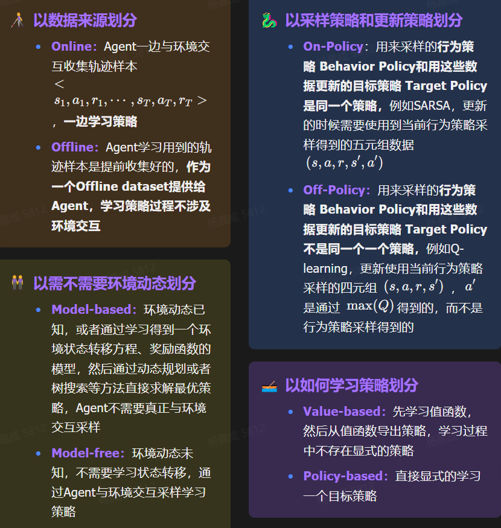

以下来自豆包

### 1. Online & Offline（在线 / 离线）

**按「数据怎么来」分**

- **Online（在线）**
  一边和环境交互，一边收集数据、一边学习。
  → 实时试错、实时更新。
- **Offline（离线）**
  只用**现成的数据集**学习，不再和环境交互。
  → 从历史经验里学，不探索。

------

### 2. On-Policy & Off-Policy（同策略 / 异策略）

**按「用谁的数据更新策略」分**

- **On-Policy（同策略）**
  用**当前正在学习的这个策略**自己产生的数据来更新自己。
  → 我用我自己的经验学我自己。
- **Off-Policy（异策略）**
  用**别的策略 / 旧策略 / 任意经验数据**来学习当前策略。
  → 学我的时候，可以看别人 / 过去的经验。

------

### 3. Model-based & Model-free（基于模型 / 无模型）

**按「有没有环境模型」分**

- **Model-based（基于模型）**
  先学**环境的模型**（状态转移、奖励函数），再用模型做规划 / 推演来学习策略。
  → 先学会 “世界规则”，再做决策。
- **Model-free（无模型）**
  不学环境模型，直接从经验里学价值或策略。
  → 不理解世界，只靠试错学会怎么做。

------

### 4. Value-based & Policy-based（基于价值 / 基于策略）

**按「学什么东西」分**

- **Value-based（基于价值）**
  先学**价值函数**（这个状态 / 动作有多好），策略由价值推导出来。
  → 代表：Q-learning、DQN。
- **Policy-based（基于策略）**
  直接学**策略本身**（输入状态→输出动作概率），不学价值或只辅助学。
  → 代表：REINFORCE、A2C/PPO。

### ==**策略和价值到底是什么？**==

##### 1. 英文原文（标准强化学习术语）

- **Value-based**
  → 直译：**基于价值的**
- **Policy-based**
  → 直译：**基于策略的**

------

##### 2. 这两个词到底在强化学习里指什么？

##### ① Value = **价值**

英文：**Value / Value function**
意思：

> 这个**状态有多好**
> 这个**动作能带来多少未来奖励**

它是一个**分数、评分、估值**。

- Q (s,a)：在状态 s 做动作 a 的**价值**
- V (s)：状态 s 本身有多**值钱**

##### ② Policy = **策略**

英文：**Policy**
意思：

> 在这个状态下，**应该做什么动作**

它是一个**行为指南、决策规则**。

- π(a|s)：在状态 s 下，采取动作 a 的**策略**
- **π(a|s) 就是智能体在看到状态 s 时，有多大概率会选动作 a**

------

##### 3. 用一句话彻底区分

- **Value-based：先算「好不好」，再选最好的。**
- **Policy-based：直接学「做什么」。**

------

##### 4. 超直白类比（秒懂）

### 你要过马路

- **Value-based**
  先给每个动作打分：
  - 现在走：-100（危险）
  - 等红灯：+10（安全）
    然后**选分最高的**。
- **Policy-based**
  直接学到一条规则：
  → **红灯停，绿灯行**
  不用打分，**直接输出动作**。

------

##### 5. 对应英文公式（最标准）

- Value-based：
  - 学 **Q(s,a)** 或 **V(s)**
- Policy-based：
  - 学 **π(a|s)**

## 3.2.8 DQN

Deep Q Network    

前面3.2.6节讲到的Q-learning算法应用到状态和动作都是离散的时候可以用表格法记录各个状态动作对的Q值，然后每次更新的时候就更新表格中对应位置的值就可以了，但是**如果状态动作空间非常大比如图像或者是连续变量，那表格法就不能使用了。这个时候就可以用参数化的神经网络来拟合Q值函数，由此诞生了DQN**

DQN = **Deep Q-Network**，深度强化学习里最经典的算法。

#### 一句话核心

用**神经网络**逼近 **Q 函数**，解决传统 Q-learning 处理不了高维状态（如图像）的问题。

#### 关键思想

1. Q-learning
   - 学习每个 “状态 - 动作” 的价值：`Q(s,a)`
   - 策略：选让 Q 最大的动作
2. Deep = 用神经网络拟合 Q
   - 输入：状态（比如游戏画面）
   - 输出：每个动作的 Q 值
3. 两大关键 trick
   - **经验回放（Experience Replay）**：存样本、随机采样，打破数据相关性，稳定训练
   - **目标网络（Target Network）**：用旧网络算目标 Q，减少波动

下面这个看不懂

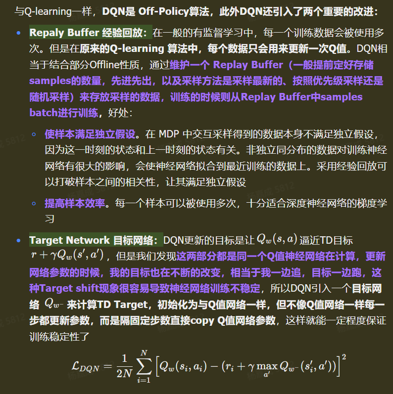

### Repaly Buffer 经验回放

1. **打破数据相关性**
   智能体按顺序采集的轨迹样本高度相关（前后状态很像），直接训练会让网络学得很偏、不稳定。经验回放随机采样，**破坏时序相关性**，更接近独立同分布，训练更稳。
2. **数据复用，提高利用率**
   传统 Q-learning 每个样本只用一次就丢了。
   Replay Buffer 让**一段经验反复用**，样本效率更高，不用一直和环境交互。
3. **让 DQN 更像有监督学习**
   从 Buffer 里抽 batch 训练，和监督学习的 mini-batch 训练一致，**更适合深度网络收敛**。
4. **支持 Off-Policy 训练**
   用旧经验训练当前网络，行为策略和目标策略可以不一样，**既保证探索，又稳定学习**。

一句话总结：
**经验回放让 DQN 数据更独立、利用率更高、训练更稳定，也让深度网络能真正学好 Q 值。**

### Target Network（目标网络）极简解析

**一句话**：强化学习里 DQN 用来**稳定训练**的一个**延迟更新的副网络**。

------

1. #### 1.核心作用

- 主网络（Q 网络）：实时更新，用来**选动作**。
- 目标网络：**隔一段时间才复制主网络参数**，用来**算目标 Q 值**。

1. #### 2.为什么需要它

如果只用一个网络，**预测值和目标值互相依赖**，训练会震荡、不收敛。
目标网络把**目标固定一小段时间**，让学习更稳。

1. #### 3.最简单理解

- 主网络：**学生**，一直在学。
- 目标网络：**参考答案**，隔一会儿才更新一次，不跟着乱跑

### DQN算法流程见文档

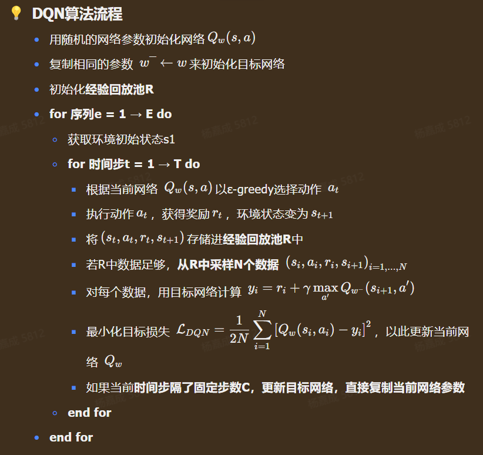

## 3.2.9 策略梯度算法

**策略梯度 = 用梯度直接 “调教” 策略，奖励当信号，好动作多出现，坏动作少出现。**

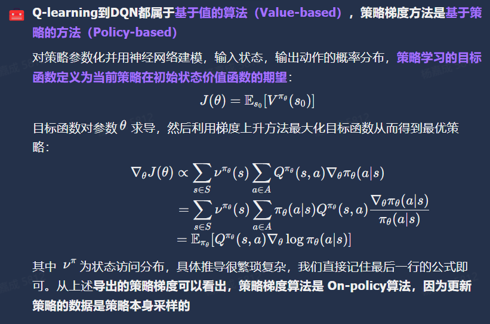

直观理解**==上式就是在每一个状态下，策略梯度让策略更多采样Q值高的动作，更少采样Q值低的动作，也可以理解为Q值函数引导策略的更新方向==**

### REINFORCE 

是**基于策略梯度的强化学习基础算法**，属于**回合式（Monte-Carlo）策略梯度方法**。

#### 核心思想

1. 直接学习**策略函数** *π**θ*(*a*∣*s*)：输入状态，输出动作概率
2. 目标：**最大化累积回报期望**
3. 用**完整回合的实际回报** *G**t* 当作梯度权重，更新策略

## 3.2.10 Actor-Critic算法

### Actor-Critic（AC）算法极简解析

Actor-Critic 是**结合策略梯度（Actor）+ 值函数（Critic）** 的**强化学习框架**，不是单一算法。

1. **Actor（演员）**
   - 输出：**动作策略** *π*(*a*∣*s*)
   - 目标：根据 Critic 的评价，**更新策略，让奖励更高**。
2. **Critic（评论家）**
   - 输出：**状态 / 动作价值** *V*(*s*) 或 *Q*(*s*,*a*)
   - 目标：**评价当前动作好不好**，给 Actor 稳定的反馈。
3. **核心思想**
   - 只用 Policy Gradient（只 Actor）：方差大、学得慢。
   - 只用 Q-learning（只 Critic）：难处理连续动作。
   - AC：**Actor 选动作，Critic 打分，两者一起迭代**。
4. **一句话总结**
   Actor-Critic = **策略网络做决策 + 价值网络做评估**，用价值函数降低策略梯度的方差，兼顾**连续动作空间**和**学习稳定性**。

## 3.2.11 PPO算法

### TRPO算法

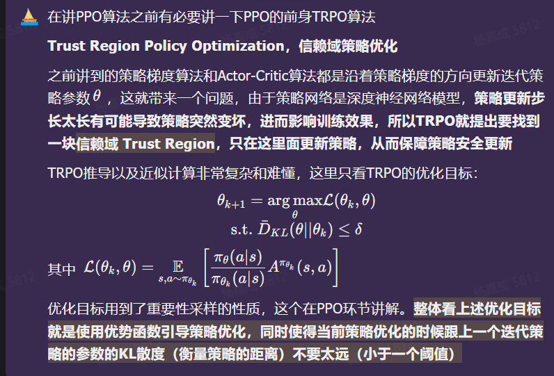

1. **传统策略梯度（含 AC）**
   直接顺着梯度方向更新策略参数，但**步长不好控制**。
   策略网络是深度网络，**步子太大**，策略会突然变差，训练崩掉、不收敛。

2. **TRPO 想解决的核心问题**
   不让策略 “一步改太狠”，保证**每次更新后，新策略不会比旧策略差**。

3. **TRPO 的核心思想：信赖域**
   画一个**信赖域（Trust Region）**：
   限制新、旧策略之间的**距离不能太大**（通常用 KL 散度衡量）。
   在这个安全区域内，再去最大化回报，做到**稳健更新**。

   - **KL 散度 = 两个策略之间的 “距离”**

   - **信赖域 = 允许策略更新的安全范围**

   - **KL ≤ δ** 就是：
     **新策略不能离旧策略太远，必须在安全区内更新。**

   - ##### 把 KL 散度 → 翻译成「信赖域」

     你可以把 KL 散度理解成：

     - KL ≈ 0：两个策略几乎一样，在**安全圈中心**
     - KL 很小：在**信赖域内部**，可以放心更新
     - KL 太大：**出圈了**，策略更新太猛，会崩

     所以 PPO 等算法做的事就是：

     1. 先画一个圈：
        **KL ≤ δ**
        → 这就是**信赖域**
     2. 在这个圈**里面**，随便你怎么最大化奖励
        → 保证**稳健更新**

4. **为什么要先讲 TRPO 再讲 PPO**

   - PPO 就是**简化版、工程友好版的 TRPO**
   - 理解了 “**限制策略更新幅度、保证单调提升**” 这个思想，再看 PPO 的 clipped 目标 / 惩罚项，就会非常自然。

一句话总结：
**TRPO 用 “信赖域” 管住策略更新的幅度，保证越学越好；PPO 是它的轻量化实用版。**

#### ==KL 散度（Kullback–Leibler Divergence）==

全称**相对熵**，核心就一句话：
用来衡量**两个概率分布 P 和 Q 之间的差异程度**。

- 不是距离（不对称：D(P||Q) ≠ D(Q||P)）
- 非负：KL ≥ 0，当且仅当 P=Q 时等于 0
- 直观理解：用**Q 去近似 P**，会带来多少信息损失/冗余

公式简写：
$$
D_{KL}(P\|Q) = \sum P(x)\log\frac{P(x)}{Q(x)}
$$
一句话总结：
**KL 散度 = 用 Q 编码 P 时多出来的平均信息量，越小越接近。**

### PPO算法和代码

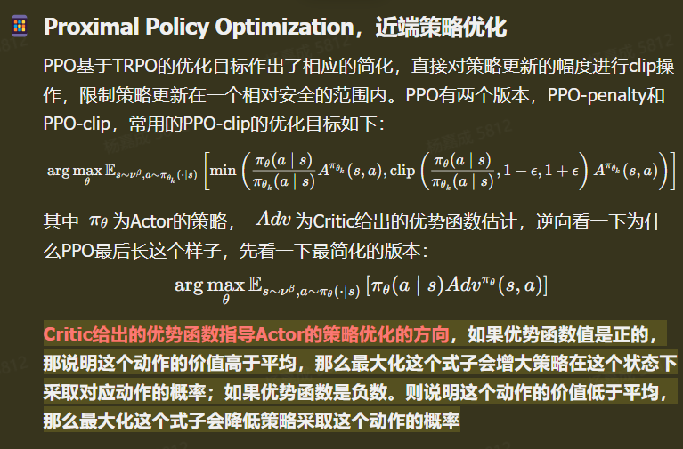

### ==PPO（近端策略优化）一句话核心==

PPO 是**深度强化学习里最常用、最稳的策略梯度算法**，它从 TRPO 简化而来，核心就是：
**更新策略时，别改太猛，把变化幅度 “夹住”，保证训练稳定。**

------

#### 关键思想

1. 继承 TRPO 的思想：
   新策略不能和旧策略差太远，否则训练会崩。
2. 但 TRPO 太复杂（要解约束优化），PPO 做了**工程化简化**，变得好实现、跑得快。

------

#### 两个主流版本

1. **PPO-penalty**
   - 给策略变化太大加**惩罚项**（KL 散度惩罚）
   - 超参数难调，现在用得少
2. **PPO-clip（最常用、默认就是它）**
   - 直接把**新旧策略的概率比**裁剪到 `[1-ε, 1+ε]` 区间
   - 简单暴力、稳定、好调参
   - 本质：**不让策略一步更新过头**

------

#### ==总结成一句超精炼==

PPO 用**裁剪概率比**的方式，低成本、稳定地限制策略更新幅度，是目前 RL 落地最主流的算法。

### PPO优化的细节

**PPO在相当于此基础(TRPO)上进一步做了一些优化**

#### 1. 重要性采样（Importance Sampling）：让旧数据也能用上

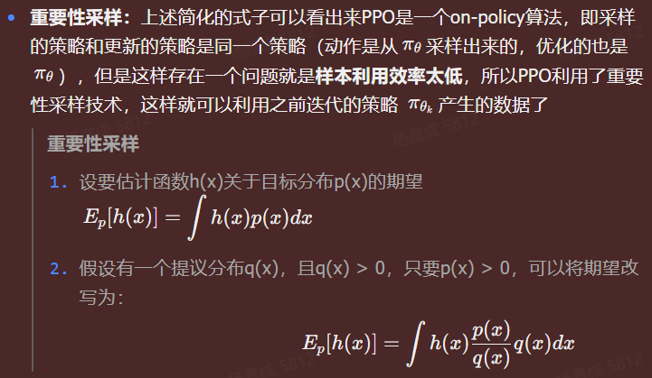

- **问题**：PPO 本质是 on-policy 算法，本来只能用当前策略 π_θ 采样的数据来更新自己，数据用完就扔，利用率很低。
- **解决**：用重要性采样，把之前策略 π_θk 产生的数据也 “变废为宝”。
- 一句话说清：
  **重要性采样 = 换个分布采样，再用权重修正，用来算难算的期望 / 积分。**
- 核心思想
  - 对**概率大、贡献大**的区域多采样
  - 用权重把 “从 q 来的样本” 拉回 “对应 p 的真实期望”
  - 本质：**改变采样分布，不改变积分值**。

------

#### 2. 策略截断（Policy Clipping）：用 “安全区间” 代替复杂的 KL 约束

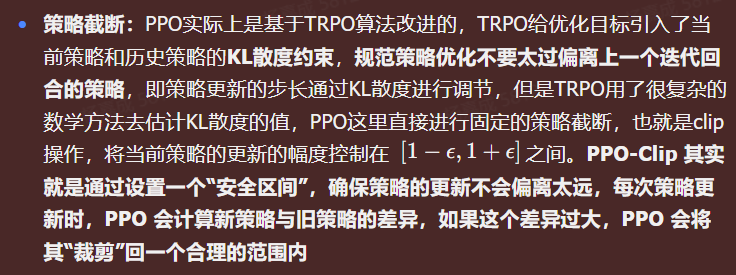

- **背景**：PPO 是从 TRPO 改进来的。TRPO 用 KL 散度约束策略更新，防止步子迈太大，但数学推导和实现都很复杂。

- #### PPO 策略截断（Clip 机制）

  - 问题：策略更新幅度过大易**震荡、崩溃**。
  - 截断：把新旧策略概率比 `r_t` 限制在 `[1−ε, 1+ε]`（ε≈0.2），**超范围就裁剪**。
  - 目的：**小步更新、稳定训练**。

- 效果

  - 相当于画了一个 “信赖域”：新策略不能离旧策略太远。
  - 如果差异太大，就把它 “裁剪” 回安全区间，保证更新稳健，不会崩。
  - 比 TRPO 的 KL 约束简单多了，工程上更好实现。

------

#### 3. GAE（广义优势估计）：又准又稳地算 “优势”

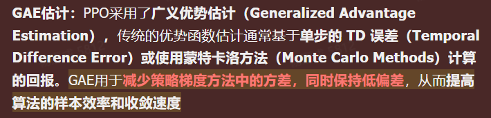

- **问题**：传统的优势函数估计，要么用单步 TD 误差，要么用蒙特卡洛全轨迹回报，前者偏差大，后者方差大。

- **传统两种估计的毛病**

  1. **单步 TD 误差**
     - 只看一步：*r*+*γV*(*s*′)−*V*(*s*)
     - 偏差小，但**方差很大**，训练很抖。
  2. **蒙特卡洛 MC**
     - 整幕走完才算总回报
     - 方差小，但**偏差大**，更新慢、样本效率低。

- ==GAE（广义优势估计）是 PPO 里用来算优势函数 $A(s,a)$ 的方法==。
  **优势函数** = 这个动作**比平均水平好多少**，是策略更新的核心依据。

  

- ##### GAE 干了什么

  GAE 就是**把多步 TD 误差加权平均**，引入一个超参 *λ*：

  - *λ*=0 → 接近单步 TD（低偏差、高方差）
  - *λ*=1 → 接近 MC（高偏差、低方差）

  它在**偏差和方差之间做折中**：

  - 方差比单步 TD 小
  - 偏差比 MC 小

  最终让 PPO：

  - 训练更稳
  - 样本效率更高
  - 收敛更快

  ------

  **一句话总结：**
  **GAE 用加权多步 TD，在偏差和方差之间取平衡，让 PPO 学得更稳、更快、更省样本。**

- GAE 的作用

  - 用多步时序差分的思想，把不同步长的 TD 误差加权平均。
  - 既减少了方差（更稳定），又保持了低偏差（更准确）。
  - 最终提升了算法的样本效率和收敛速度。

  

------

### ==一句话总结==

PPO 做的三件事：

1. **重要性采样**：让旧数据也能用来更新策略，提高样本利用率。
2. **策略截断**：用 clip 操作画个安全圈，让策略更新更稳。
3. **GAE**：更聪明地算优势，让训练又快又准。

------

### PPO代码见文档

### ==PPO优点==

**稳定性强，实现容易，适合高维，平衡探索和利用，无约束优化等**

1. **稳定性强**
   训练过程不容易崩，梯度不会乱跳，比传统策略梯度靠谱很多。
2. **实现简单**
   代码好写、逻辑清晰，工程上很友好，是强化学习里最 “落地” 的算法之一。
3. **适合高维空间**
   图像、连续动作、复杂状态都能处理，对大环境、大动作空间很友好。
4. **天然平衡探索与利用**
   用随机策略采样，一边更新策略一边自然探索，不用额外复杂设计。
5. **无约束优化，好求解**
   把原本带约束的优化问题变成**带裁剪目标的无约束问题**，训练更稳定、更好优化。

一句话概括：
**PPO 简单、稳、好用，高维场景能打，还能平衡探索利用，是 RL 里最通用、最实用的策略梯度算法**

